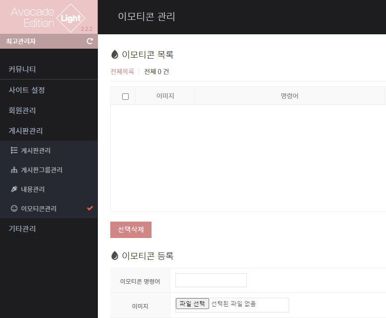
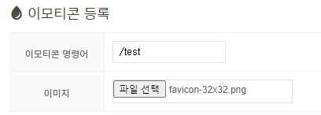
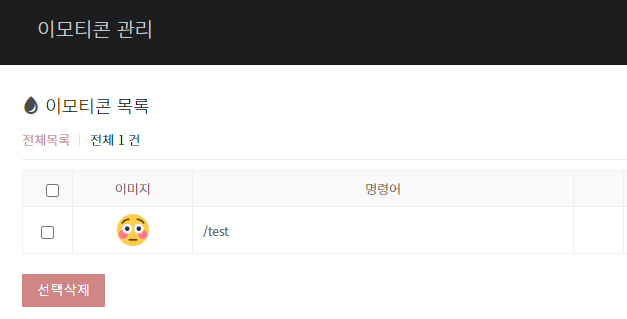
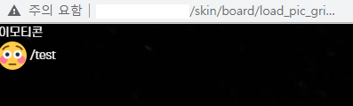
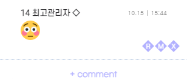

아보카도 에디션 라이트에는 이모티콘창을 띄울 수는 있지만, 등록할 수 있는 방법이 없습니다.
이는 db는 만들어졌으나 그누보드와 연동되지 않았기 때문입니다.
코드를 약간만 수정하여 아보카도 에디션 라이트에서도 이모티콘을 써봅시다.
진행 전, 반드시 백업부터 해주세요.

<!--truncate-->

## 1. 들어가기 전에

아보카도 에디션 라이트에는 이모티콘창을 띄울 수는 있지만, 등록할 수 있는 방법이 없습니다.
이는 db는 만들어졌으나 그누보드 최초 설치 시 이모티콘 테이블이 만들어지지 않았기 때문입니다.
코드를 약간만 수정하여 아보카도 에디션 라이트에서도 이모티콘을 써봅시다.
아보카도 에디션 설치 및 코드를 열어보는 방법은 생략되어있습니다.

**진행 전, 반드시 백업부터 해주세요.**

## 2. 수정해야할 파일

:::danger
**dbconfig.php** 파일은 매우 중요하고 민감하게 다루어야 할 파일입니다.
꼭 원본을 백업해두시고 진행해주세요.
:::

```php title="data/dbconfig.php"
// ...
$g5['css_table'] = G5_TABLE_PREFIX.'css_config'; // CSS STYLE 정의 저장하는 테이블
// highlight-next-line
$g5['emoticon_table'] = G5_TABLE_PREFIX.'emoticon'; // 이모티콘 테이블
?>
```

- 맨 마지막 줄에 코드를 한 줄 추가합니다.

```php title="adm/admin.menu300.php"
<?php
$menu['menu300'] = array (
    array('300000', '게시판관리', ''.G5_ADMIN_URL.'/board_list.php', 'board'),
    array('300100', '게시판관리', ''.G5_ADMIN_URL.'/board_list.php', 'bbs_board'),
    array('300200', '게시판그룹관리', ''.G5_ADMIN_URL.'/boardgroup_list.php', 'bbs_group'),
    array('300600', '내용관리', G5_ADMIN_URL.'/contentlist.php', 'scf_contents', 1),
    // highlight-next-line
    array('300700', '이모티콘관리', G5_ADMIN_URL.'/emoticon_list.php', 'mmb_emoticon', 1)
);
?>
```

- 맨 마지막 줄에 코드를 추가합니다.

## 3. 추가해야할 파일

```php title="adm/emoticon_form_update.php"
<?php
$sub_menu = "300700";
include_once('./_common.php');

auth_check($auth[$sub_menu], 'w');
check_token();

@mkdir(G5_DATA_PATH.'/emoticon', G5_DIR_PERMISSION);
@chmod(G5_DATA_PATH.'/emoticon', G5_DIR_PERMISSION);

if ($img = $_FILES['me_img']['name']) {
    if (!preg_match("/\.(gif|jpg|png)$/i", $img)) {
        alert("이모티콘 이미지가 gif, jpg, png 파일이 아닙니다.");
    } else {
		// 확장자 따기
		$exp = explode(".", $_FILES['me_img']['name']);
		$exp = $exp[count($exp)-1];

		$emoticon_path = G5_DATA_PATH.'/emoticon';
		$emoticon_image_code = time().".".$exp;
		$emoticon_image_path = "$emoticon_path/$emoticon_image_code";
		$emoticon_image_url = "/data/emoticon/$emoticon_image_code";

		move_uploaded_file($_FILES['me_img']['tmp_name'], $emoticon_image_path);
		chmod($emoticon_image_path, 0606);
		$sql_common = " , me_img = '{$emoticon_image_url}' ";
	}
}
sql_query(" insert into {$g5['emoticon_table']} set me_text = '{$me_text}'".$sql_common);

goto_url('./emoticon_list.php?'.$qstr);
?>
```

```php title="adm/emoticon_list_update.php"
<?php
$sub_menu = "300700";
include_once('./_common.php');

check_demo();

auth_check($auth[$sub_menu], 'd');

check_token();

$count = count($_POST['chk']);
if(!$count)
    alert($_POST['act_button'].' 하실 항목을 하나 이상 체크하세요.');

for ($i=0; $i<$count; $i++)
{
    // 실제 번호를 넘김
    $k = $_POST['chk'][$i];

    // 이모티콘 등록 내역
    $sql = " select * from {$g5['emoticon_table']} where me_id = '{$_POST['me_id'][$k]}' ";
    $row = sql_fetch($sql);

    if(!$row['me_id'])
        continue;

    // 이모티콘 내역삭제
    $sql = " delete from {$g5['emoticon_table']} where me_id = '{$_POST['me_id'][$k]}' ";
    sql_query($sql);

	// 이모티콘 이미지 삭제
	@unlink(G5_PATH.$row['me_img']);
}

goto_url('./emoticon_list.php?'.$qstr);
?>
```

```php title="adm/emoticon_list.php"
<?php
$sub_menu = "300700";
include_once('./_common.php');

auth_check($auth[$sub_menu], 'r');

$token = get_token();

$sql_common = " from {$g5['emoticon_table']} ";

$sql_search = " where (1) ";

if (!$sst) {
	$sst  = "me_id";
	$sod = "desc";
}
$sql_order = " order by {$sst} {$sod} ";

$sql = " select count(*) as cnt
			{$sql_common}
			{$sql_search}
			{$sql_order} ";
$row = sql_fetch($sql);
$total_count = $row['cnt'];

$rows = 18;
$total_page  = ceil($total_count / $rows);  // 전체 페이지 계산
if ($page < 1) $page = 1; // 페이지가 없으면 첫 페이지 (1 페이지)
$from_record = ($page - 1) * $rows; // 시작 열을 구함

$sql = " select *
			{$sql_common}
			{$sql_search}
			{$sql_order}
			limit {$from_record}, {$rows} ";
$result = sql_query($sql);

$listall = '<a href="'.$_SERVER['PHP_SELF'].'" class="ov_listall">전체목록</a>';

$g5['title'] = '이모티콘 관리';
include_once ('./admin.head.php');

$colspan = 9;

$po_expire_term = '';
if($config['cf_point_term'] > 0) {
	$po_expire_term = $config['cf_point_term'];
}

?>

<h2 class="h2_frm">이모티콘 목록</h2>

<div class="local_ov01 local_ov">
	<?php echo $listall ?>
	전체 <?php echo number_format($total_count) ?> 건
</div>

<form name="fpointlist" id="fpointlist" method="post" action="./emoticon_list_update.php" onsubmit="return fpointlist_submit(this);">
<input type="hidden" name="sst" value="<?php echo $sst ?>">
<input type="hidden" name="sod" value="<?php echo $sod ?>">
<input type="hidden" name="sfl" value="<?php echo $sfl ?>">
<input type="hidden" name="stx" value="<?php echo $stx ?>">
<input type="hidden" name="page" value="<?php echo $page ?>">
<input type="hidden" name="token" value="<?php echo $token ?>">

<div class="tbl_head01 tbl_wrap">
	<table>
	<caption><?php echo $g5['title']; ?> 목록</caption>
	<colgroup>
		<col style="width: 50px;" />
		<col style="width: 120px;"/>
		<col  />
		<col style="width: 50px;" />
		<col style="width: 120px;"/>
		<col  />
		<col style="width: 50px;" />
		<col style="width: 120px;"/>
		<col  />
	</colgroup>
	<thead>
	<tr>
		<th scope="col">
			<label for="chkall" class="sound_only">이모티콘 내역 전체</label>
			<input type="checkbox" name="chkall" value="1" id="chkall" onclick="check_all(this.form)">
		</th>
		<th scope="col">이미지</th>
		<th scope="col">명령어</th>

		<th scope="col">&nbsp;</th>
		<th scope="col">이미지</th>
		<th scope="col">명령어</th>

		<th scope="col">&nbsp;</th>
		<th scope="col">이미지</th>
		<th scope="col">명령어</th>
	</tr>
	</thead>
	<tbody>
	<?php
	for ($i=0; $row=sql_fetch_array($result); $i++) {
		$bg = 'bg'.($i%2);
	?>

<? if($i % 3 == 0) {
	if($i == 0) { echo "</tr>"; }
?>
	<tr class="<?php echo $bg; ?>">
<? } ?>

		<td style="text-align: center">
			<input type="hidden" name="me_id[<?php echo $i ?>]" value="<?php echo $row['me_id'] ?>" id="me_id_<?php echo $i ?>">
			<input type="checkbox" name="chk[]" value="<?php echo $i ?>" id="chk_<?php echo $i ?>">
		</td>
		<td style="text-align: center"><?php echo ""; ?></td>
		<td class="txt-left"><?php echo $row['me_text']; ?></td>
	<?php
	}

	if ($i == 0)
		echo '<tr><td colspan="'.$colspan.'" class="empty_table">자료가 없습니다.</td></tr>';

	if($i%3) {
		for($j = 0; $j < 3-($i%3); $j++) {
			echo "<td></td><td></td><td></td>";
		}
	}

	if($i > 0) { echo "</tr>"; }
	?>
	</tbody>
	</table>
</div>

<div class="btn_list01 btn_list">
	<input type="submit" name="act_button" value="선택삭제" onclick="document.pressed=this.value">
</div>

</form>

<?php echo get_paging(G5_IS_MOBILE ? $config['cf_mobile_pages'] : $config['cf_write_pages'], $page, $total_page, "{$_SERVER['PHP_SELF']}?$qstr&amp;page="); ?>

<section id="point_mng">
	<h2 class="h2_frm">이모티콘 등록</h2>

	<form name="fpointlist2" method="post" id="fpointlist2" action="./emoticon_form_update.php" autocomplete="off" enctype="multipart/form-data">
	<input type="hidden" name="sfl" value="<?php echo $sfl ?>">
	<input type="hidden" name="stx" value="<?php echo $stx ?>">
	<input type="hidden" name="sst" value="<?php echo $sst ?>">
	<input type="hidden" name="sod" value="<?php echo $sod ?>">
	<input type="hidden" name="page" value="<?php echo $page ?>">
	<input type="hidden" name="token" value="<?php echo $token ?>">

	<div class="tbl_frm01 tbl_wrap">
		<table>
		<colgroup>
			<col style="width: 120px;">
			<col>
		</colgroup>
		<tbody>
		<tr>
			<th scope="row"><label for="me_text">이모티콘 명령어<strong class="sound_only">필수</strong></label></th>
			<td><input type="text" name="me_text" id="me_text" class="required frm_input" required></td>
		</tr>
		<tr>
			<th scope="row"><label for="me_img">이미지<strong class="sound_only">필수</strong></label></th>
			<td><input type="file" name="me_img" id="me_img"></td>
		</tr>
		</tbody>
		</table>
	</div>

	<div class="btn_confirm01 btn_confirm">
		<input type="submit" value="확인" class="btn_submit">
	</div>

	</form>

</section>

<script>
function fpointlist_submit(f)
{
	if (!is_checked("chk[]")) {
		alert(document.pressed+" 하실 항목을 하나 이상 선택하세요.");
		return false;
	}

	if(document.pressed == "선택삭제") {
		if(!confirm("선택한 자료를 정말 삭제하시겠습니까?")) {
			return false;
		}
	}

	return true;
}
</script>

<?php
include_once ('./admin.tail.php');
?>

```

## 3. 결과 확인

### 관리자 페이지

- 관리자 페이지에 `이모티콘 관리`가 생겼습니다.
  

- 넣고 싶은 아이콘을 입력하고 명령어도 `/`와 함께 적어줍니다.
  
- 우측 상단에 `등록`을 눌러주면 등록 성공!
  

### 게시판에서 써보기

- [이모티콘]을 누르면 등록된 이모티콘 목록이 보입니다.  
  

- 댓글창에 아까 썼던 이모티콘 명령어`(ex: /test)`를 사용한 뒤 등록하면 이모티콘을 사용할 수 있습니다.

  

## Reference

- [아보카도 에디션 마스터](https://github.com/tateck-develop/AvocadoEdition/tree/master/AvocadoEdition/adm)
- [아보카도 에디션 퍼스널](https://extrashot.postype.com/post/12533518)
