정말 우여곡절이 많았기 때문에 기록으로 남겨둡니다.
가급적 `mac`으로 진행하시는 것이 편합니다.  
이 기록은 `window10` 환경에서 진행되었습니다.

<!--truncate-->

## 발단

### 1. 신청

도큐사우르스는 친절하게 [검색 페이지](https://docusaurus.io/ko/docs/search)를 생성하여 검색을 다는 방법을 알려주고 있습니다. 보면 `알골리아 DocSearch`를 사용하라고 강력 추천하고 있는 것을 확인할 수 있습니다. 이 홈페이지는 개발 블로그인데다가 저장소도 공개하고 있어서 당연히 곧장 승낙될 줄 알았습니다.

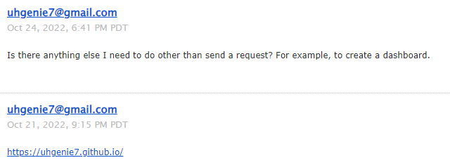  
10월 21일에 신청했으니까 거의 일주일은 기다린 것 같습니다. 고새 못 참고 대체 라이브러리(`docusaurus-search-local`)를 깔았는데, 한국어 지원을 안 해줘서 얼른 갈아치우고 싶었습니다.

### 2. 답장

그런데...  
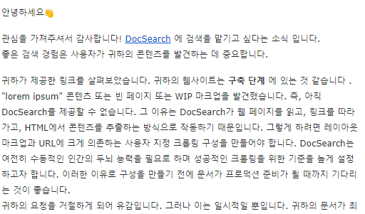  
_구축은 끝났는데... 왜지... 왜죠? 너무 아무것도 없었나요? 하지만, 이제 막 다시 시작하는 블로그인걸요!_  
하지만 이런 이야기를 구구절절 이야기하기보다는 그냥 제가 직접 다는 것이 더 나을 것 같다는 생각이 들었습니다. 일주일을 또 기다릴 자신이 없었거든요.

## Algolia

DocSearch는 Algolia를 토대로 만들어져 있습니다. 때문에 Algolia 대시보드로 직접 구축하면 이런 승인을 받을 필요가 없습니다.

도큐사우르스에서도 **무료로 제공되는 문서 검색 기능에 적합하지 않거나 방화벽 뒤에 있거나 내부에서만 공개한 경우에는**라고 이야기하고 있습니다.

- [직접 관리하는 방법이 담긴 링크](https://docsearch.algolia.com/docs/legacy/run-your-own/)

### 1. 알골리아 가입하기

- 회원가입을 자유롭게 한 뒤 Free를 사용해주세요. 저는 깃허브로 가입했습니다.
  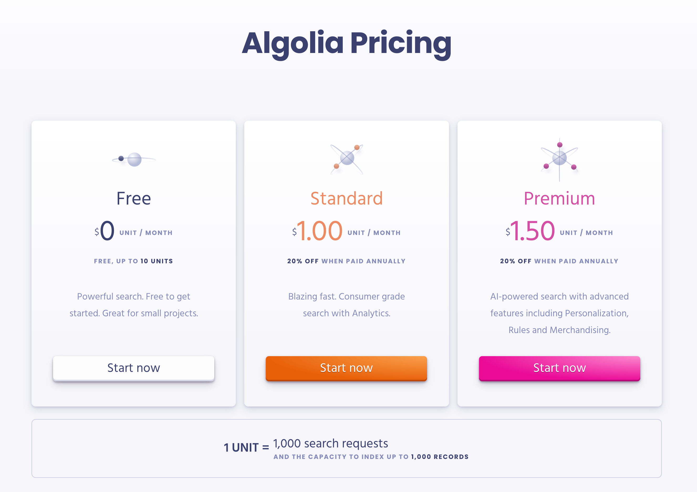

### 2. 대시보드의 index를 생성한다.

- 이 부분은 index name이 될 것입니다. 자유롭게 지어주세요.
  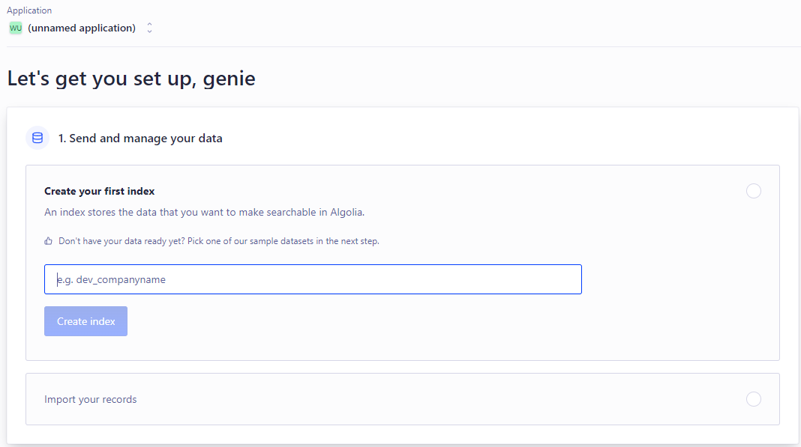

### 3. Overview으로 가서 api key를 확인한다.

- create index를 하고나면 뭔가 더 설정하라는듯이 recode ~ 이런식으로 나올 텐데 무시하고 Overview로 갑니다.

  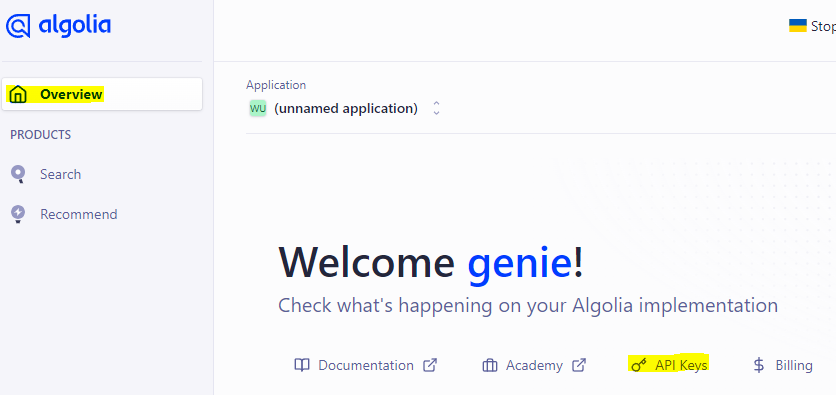

- api key가 많지만 저희가 알아야 할 것은 몇 가지 없습니다. 다음 순서대로 api key를 생성하세요.
- `All Api keys` tab으로 이동 후 `New API Key` 으로 key 생성
  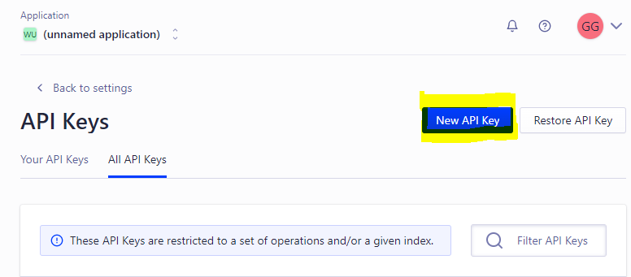
- ACL에서 addObject , editSettings , deleteIndex 를 추가
  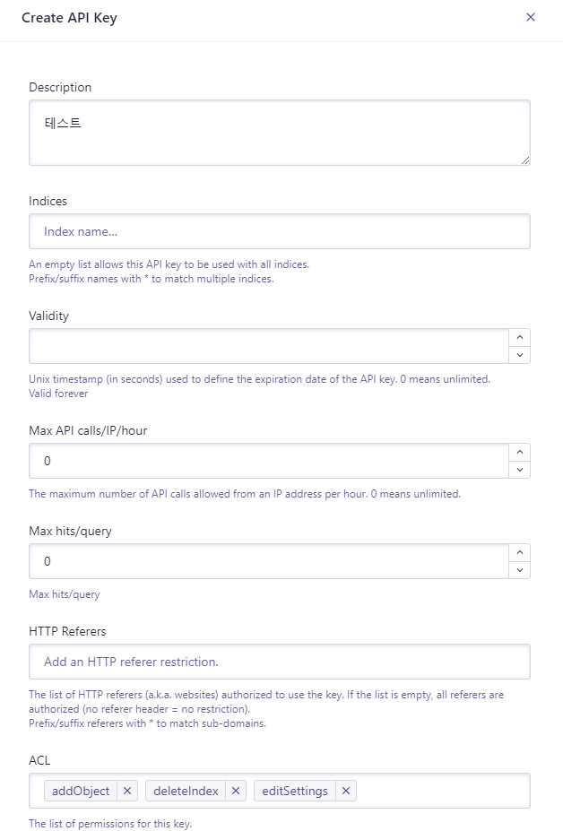
- 성공적으로 api key가 생성된 것을 확인
  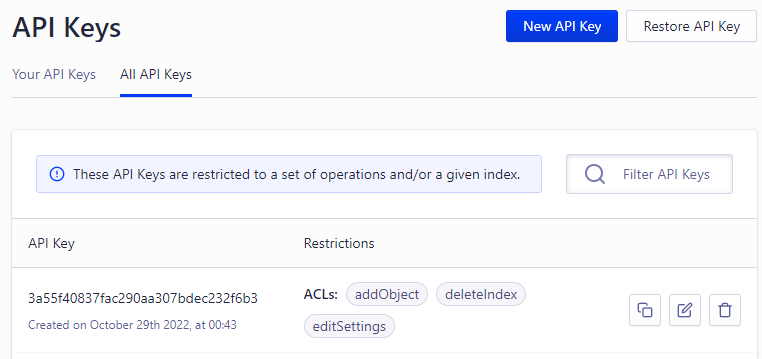

## docusaurus project

여기서부터 삽질이 시작됩니다.

### 1. .env

프로젝트 root에 `.env` 파일을 생성합니다.  
확인해야 할 것은 `APPLICATION_ID` 와 아까 만들어준 `API_KEY` 입니다.  
`APPLICATION_ID`는 `Your API Keys` 탭에 있습니다.
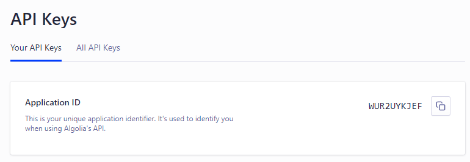

```bash title=".env"
APPLICATION_ID=WUR2UYKJEF
API_KEY=3a55f40837fac290aa307bdec232f6b3
```

### 2. config.json

1. 프로젝트 root에 `config.json` 파일을 생성합니다.
2. [여기서](https://github.com/algolia/docsearch-configs/blob/master/configs/docusaurus-2.json) 코드를 복사 붙여넣기 합니다.
3. 복사한 코드 중 세 군데를 본인의 사이트에 맞게 고칩니다.
   - index_name: 회원가입 후 생성했던 index의 name
   - start_urls: 배포된 문서의 url (홈페이지 주소)
   - sitemap_urls: 배포된 문서의 `sitemap.xml` url
     - Docusaurus2는 자동으로 sitemap을 만들어줍니다. `{BASE_URL}/sitemap.xml` 을 주소창에 입력하시면 사이트맵이 출력될 것입니다.

### 3. Docker & jq

대망의 삽질의 원인. 도커입니다. 도커는 윈도우에서 돌리기 쉽지 않습니다. 이 구간만 잘 넘긴다면, 혹은 도커를 이미 돌릴 줄 아시는 분은 쉽게 검색창을 달 수 있으실 겁니다.

#### 1. 도커 설치

- [여기서 설치하시면 됩니다](https://docs.docker.com/get-docker/)
- 기다리면서 [허브 도커](https://hub.docker.com/)에 겸사겸사 가입도 했습니다.
- 윈도우의 `PowerShell`을 관리자 권한으로 실행
  - `wsl --install` 입력  
     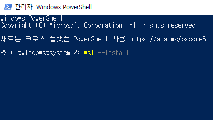
  - [WSL 설치 - 누르면 다운로드 됩니다.](https://wslstorestorage.blob.core.windows.net/wslblob/wsl_update_x64.msi)
- 재부팅 후 Docker Desktop 실행

:::info
**An error occurred**
Failed to start at Docker.Engines.LinuxkitDaemonStartup.`<WaitAsync>`d\_\_5.MoveNext() in ...

에러가 뜬다면 cmd 에

`netsh winsock reset` 를 해주세요.

:::

:::info
you need to log out of windows then your docker-users membership will be taken into account

에러가 뜬다면 재부팅. 그럼에도 되지 않는다면 다음 사이트를 참조.

- [도커 권한](https://goddaehee.tistory.com/280)

window10 home의 경우 로컬 사용자 및 그룹이 없다. 다음 사이트를 참조하여 외부 프로그램을 사용.

- [로컬 사용자 및 그룹 외부 프로그램](https://blog.naver.com/PostView.nhn?blogId=toruin84&logNo=222006851918)

:::

#### 2. jq 설치

- **관리자 권한**으로 `cmd` 실행
- 아래 코드를 복사 붙여넣기

```bash
@"%SystemRoot%\System32\WindowsPowerShell\v1.0\powershell.exe" -NoProfile -InputFormat None -ExecutionPolicy Bypass -Command "iex ((New-Object System.Net.WebClient).DownloadString('https://chocolatey.org/install.ps1'))" && SET "PATH=%PATH%;%ALLUSERSPROFILE%\chocolatey\bin"
```

- `Do you want to run the script?`가 뜨면 y를 입력 후 엔터
- 이미 Chocolatey 가 설치되어 있다며 에러를 뿜는다면 `C:\ProgramData\chocolatey` 폴더를 지운 후 다시 설치.

#### 3. Docker 이미지를 사용하여 웹사이트를 크롤링하기

윈도우의 터미널에서는 cat이 없기 때문에 agolia가 제시하는 명령어가 잘 안 먹습니다. git bash를 이용해서 도커 명령어를 사용할 것입니다.

1. 프로젝트를 파일 탐색기에서 찾아 열고, `git bash here` 을 누릅니다.
   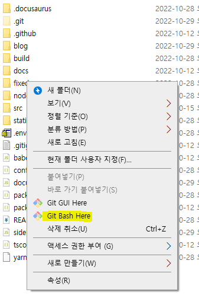

2. git bash 에서 다음 명령어를 입력합니다.

```bash
docker run -it --env-file=.env -e "CONFIG=$(cat ./config.json | jq -r tostring)" algolia/docsearch-scraper
```

:::info

the input device is not a TTY. If you are using mintty, try prefixing the command with 'winpty'

에러가 뜬다면 접두어 `winpty`를 붙여주세요

```
winpty docker run -it --env-file=.env -e "CONFIG=$(cat ./config.json | jq -r tostring)" algolia/docsearch-scraper
```

:::
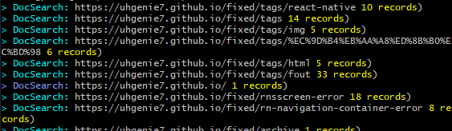

이렇게 뜬다면 성공입니다!

:::info

error during connect: This error may indicate that the docker daemon is not running.: Get http://%2F%2F.%2Fpipe%2Fdocker_engine/v1.24/images/json: open //./pipe/docker_engine: The system cannot find the file specified.

에러가 뜬다면 도커가 연결되었는지(Docker Desktop is Running) 확인해주세요.

안 된다면 cmd에서 다음 코드를 입력합니다.

```
cd C:\Program Files\Docker\Docker
DockerCli.exe -SwitchDaemon
```

:::

:::info

그 밖의 도커 관련 에러는 구글에 검색해보세요.

:::

#### 4. agolia 에 잘 들어갔는지 확인

- 감격스럽기 그지없습니다.
  

### 4. docusaurus.config.js

거의 다 왔으니 힘냅시다.  
Algolia 설정을 추가하기만 하면 됩니다.
단 여기 들어가는 api key는 앞서 설정한 api key와 조금 다릅니다. 검색 전용 API Key를 찾아서 입력해줍시다.

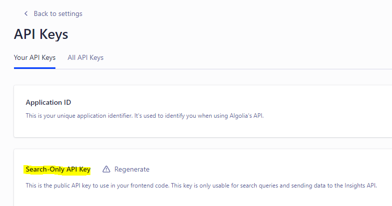

```js title="docusaurus.config.js"
module.exports = {
  // ...
  themeConfig: {
    algolia: {
      apiKey: 'Search-Only API Key',
      indexName: '아까 그 index 이름',
      appId: 'Application ID',
      contextualSearch: false, // i18n 여부에 따라 true, false.
      // i18n: ko를 해두시고 false로 해두어야 영어로 안 뜹니다.
    },
  },
  // ...
};
```

## 완료

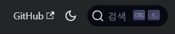

<small>mac으로 했으면 어땠을까... 훨씬 쉽게 했겠지요...?</small>

## Reference

- [Docusaurus로 문서 관리하기 - 2](https://younho9.dev/docusaurus-manage-docs-2)
- [나만의 실행](https://docsearch.algolia.com/docs/legacy/run-your-own/)
- [Docker Desktop for Windows](https://forums.docker.com/t/solved-docker-failed-to-start-docker-desktop-for-windows/106976/26)
