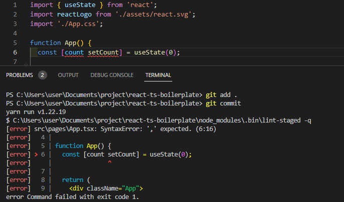
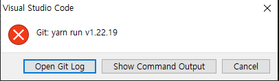
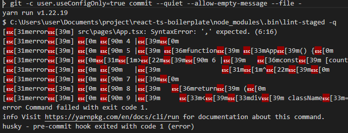
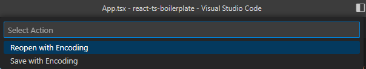
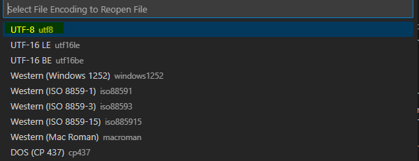
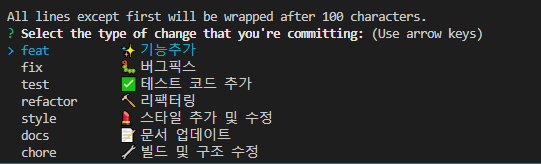

깃허브 레포를 구경하다 보면 커밋 컨벤션에 맞게 커밋이 찍혀있는 것을 종종 볼 수 있다.  
나 역시도 나름의 컨벤션을 지켜 커밋하지만, 일정에 쫓겨 어떤 것은 대문자로, 어떤 것은 소문자로 커밋을 날릴 때가 종종 있다. (ex: Feat, feat)  
혼자서 커밋을 찍는다면 상관없을지 몰라도, 회사에서는 일관성 있는 컨벤션을 지킬 필요가 있다. 그것을 도와주는 도구가 husky이다.

아래 글은 커밋하기 전에 husky로 lint 체크, prettier 체크, 커밋 메시지 체크 글을 다룬다.

<!--truncate-->

:::note Environment Info:

```
Binaries:
    Yarn: 1.22.16

npmPackages:
    husky: ^8.0.0
```

:::

## 1. 커밋 전에 eslint, prettier 체크하기

:::note
eslint, prettier 규칙은 이미 설정이 되어있다고 가정한다
:::

### 1. lint-staged 설치

```bash
yarn add -D lint-staged
```

### 2. lint-staged package.json에 등록

```json title="package.json"
{
  "name": "my-supporter",
  "private": true,
  "version": "0.0.1",
  "license": "MIT",
  "scripts": {
    "lint": "eslint src/**/*.{js,jsx,ts,tsx} --fix"
  },
  // highlight-start
  "lint-staged": {
    "*.{ts,tsx}": ["prettier --write", "eslint --fix"]
  }
  // highlight-end
}
```

## 2. Husky

husky는 git hook 사용을 도와주는 라이브러리이며 husky를 사용하면 git을 사용할 때 특정 스크립트를 실행 시킬 수 있다.
설치 방법은 [공식문서](https://typicode.github.io/husky/#/?id=install)에서 친절히 알려주고 있다.

### 1. husky 등록 방법

```bash
yarn add -D husky
npx husky install
npm pkg set scripts.prepare="husky install"
```

이렇게 하면 `scripts`에 `prepare`가 등록된다.

```json title="package.json"
{
  "scripts": {
    "prepare": "husky install"
  }
}
```

:::note
yarn2는 `prepare`를 지원하지 않으므로 다른 방식으로 설치해야 한다.

```json title="package.json"
{
  "private": true, // ← your package is private, you only need postinstall
  "scripts": {
    "postinstall": "husky install"
  }
}
```

:::

### 2. lint-staged hook 만들기

앞에서 설정해둔 lint-staged를 husky로 hook을 만든다.

```bash
npx husky add .husky/pre-commit yarn lint-staged
```

:::caution windows 에러

`npx husky add`를 했을 때 `help message`를 본다면, root에 `.huskyrc.json`를 만들고

```json title=".huskyrc.json"
{
  "hooks": {
    "pre-commit": "./node_modules/.bin/lint-staged"
  }
}
```

를 적용해보길 바란다.
:::

### 3. 잘 되는지 확인

의도적으로 코드를 틀리게 한 뒤 커밋 푸시를 시도했다.

```
git add .
git commit
```



이처럼 커밋되지 않고 에러를 표출해준다.

### 4. 에러 해결 과정

#### 1. Windows + yarn1 환경에서의 에러

Windows에서 Git Bash(stdin is not a tty)와 함께 Yarn을 사용할 때, Git 후크가 실패할 수 있다.

- 1. `.husky/common.sh` 생성

```sh title=".husky/common.sh"
command_exists () {
  command -v "$1" >/dev/null 2>&1
}

# Workaround for Windows 10, Git Bash and Yarn
if command_exists winpty && test -t 1; then
  exec < /dev/tty
fi
```

- 2. Yarn 커맨드를 사용하는 hook에 `common.sh` 커맨드 붙여넣기

```sh title=".husky/pre-commit"
#!/usr/bin/env sh
. "$(dirname "$0")/_/husky.sh"
// highlight-next-line
. "$(dirname -- "$0")/common.sh"

yarn lint-staged
```

#### 2. lint-staged는 잘 되지만, lint 검사를 과하게 하여 터미널에 출력되는 현상

```
◼ Preparing lint-staged...
◼ Preparing lint-staged...
◼ Running tasks for staged files...
◼ Preparing lint-staged...
◼ Running tasks for staged files...
◼ Applying modifications from tasks...
◼ Preparing lint-staged...
◼ Running tasks for staged files...
◼ Applying modifications from tasks...
◼ Cleaning up temporary files...
⠋ Preparing lint-staged...
```

이 경우 `yarn lint-staged` 커맨드 뒤에 -q 를 붙여준다.

```sh title=".husky/pre-commit"
#!/usr/bin/env sh
. "$(dirname "$0")/_/husky.sh"
. "$(dirname -- "$0")/common.sh"

// highlight-next-line
yarn lint-staged -q
```

#### 3. hook error가 alert로 띄워지고 글자가 깨지는 현상

알럿창으로 Git commit error 로 확인하라고 뜨는 경우, 그리고 Git commit error로 확인하여도 문자를 알아볼 수 없을 만큼 이상한 글자로 깨지는 것을 볼 수 있다.




이것은 유니코드의 문제로 IDE의 유니코드를 `UTF-8`로 바꿔주면 된다.

1. 우측 하단 UTF-16 누르기

   

2. Reopen with Encoding

   

3. UTF-8 선택

   

## 3. commit-msg hook 등록하기

이 기세를 몰아 커밋 메시지도 hook 으로 관리하여 컨벤션을 맞춰보자.
대부분의 커밋 컨벤션은 아래의 형태로 맞춰지고 있다.

```
<type>[optional scope]: <description>

[optional body]

[optional footer(s)]
```

```
// 실제 예시
chore: run tests on travis ci
fix(server): send cors headers
feat(blog): add comment section
```

나 역시도 이러한 모습으로 커밋 컨벤션을 가져가는 편인데, 요즘 유의 깊게 보고 있는 `gitmoji 기반 커밋 메시지 컨벤션`에 관심이 더 끌려 그것으로 적용하려고 한다.

[gitmoji](https://gitmoji.dev/)는 커밋 메시지 접두어에 이모지를 붙일 수 있게 하는 라이브러리로 `feat`이 아닌 ✨을 붙여 직관적으로 어떤 커밋인지 알 수 있다는 장점이 있다.

:::note 참조
✨가 아닌 `feat` 커밋 컨벤션을 유지하고자 한다면 `@commitlint/config-conventional`를 `commitlint.config.js`파일에 등록한다

[commitlint 사이트](https://commitlint.js.org/#/) 참조.
:::

### 1. commitlint, commitlint-config-gitmoji 설치

- commitlint : 커밋메시지가 규칙대로 잘 적용되었는지 확인
- commitlint-config-gitmoji : 깃모지 커밋메시지 컨벤션

```
yarn add -D commitlint commitlint-config-gitmoji
```

### 2. commitlint.config.js에 gitmoji 설정 추가

```
echo "module.exports = {extends: ['gitmoji']}" > commitlint.config.js
```

### 3. commit-msg husky에 hook 추가

```
npx husky add .husky/commit-msg 'npx --no-install commitlint --edit $1'
```

```sh title=".husky/commit-msg"
#!/usr/bin/env sh
. "$(dirname -- "$0")/_/husky.sh"

npx --no-install commitlint --edit $1

```

이제 `git add .`, `git commit -m ":feat: some message"` 을 커맨드하면 컨벤션에 맞게 적었는지 확인할 수 있다.

하지만 `config-conventional`와는 달리 깃모지 컨벤션은 이모지도 달아야하고, 문자만 있는 커밋 메시지 컨벤션보다 지키기 어렵기 때문에 대화형 터미널로 쉽게 커밋을 찍을 필요가 있다.

## 4. commitizen 추가

commitizen는 CLI에서 커밋할 때 대화형 형식으로 메시지를 입력하여 규칙에 따라 형식으로 커밋 메시지를 작성할 수 있게 해준다.

### 1. 설치

```
yarn add --dev commitizen cz-customizable
```

### 2. package.json에 path 등록

```json title="package.json"
{
//
  "config": {
    "commitizen": {
      "path": "node_modules/cz-customizable"
    }
  },
},

```

### 3. .cz-config.js 에 터미널에 띄울 코드 작성

root에 `.cz-config.js`를 만들고 깃모지를 등록한다.

아래는 내가 자주 쓰는 깃모지이다.

```js
module.exports = {
  types: [
    { name: 'feat \t\t✨ 기능추가', value: '✨ feat' },
    { name: 'fix \t\t🐛 버그픽스', value: '🐛 fix' },
    {
      name: 'test \t\t✅ 테스트 코드 추가',
      value: '✅ test',
    },
    {
      name: 'refactor \t🔨 리팩터링',
      value: '🔨 refactor',
    },
    {
      name: 'style \t💄 스타일 추가 및 수정',
      value: '💄 style',
    },
    { name: 'docs \t\t📝 문서 업데이트', value: '📝 docs' },
    {
      name: 'chore \t🔧 빌드 및 구조 수정',
      value: '🔧 chore',
    },
  ],
  allowCustomScopes: false,
  allowBreakingChanges: ['feat', 'fix'],
  skipQuestions: ['body'],
  subjectLimit: 100,
};
```

잘 되는지 확인하려면 `npx cz`를 커맨드해보길 바란다.

### 4. commitlint.config.js 규칙 추가

[공식문서](https://commitlint.js.org/#/reference-rules)를 참조하여 gitmoji 룰과 맞추어서 정교한 룰을 가져가보도록 하자

```js
module.exports = {
  extends: ['gitmoji'],
  rules: {
    'header-max-length': [0, 'always', 100],
    'type-enum': [
      2,
      'always',
      ['feat', 'fix', 'test', 'refactor', 'style', 'docs', 'chore'],
    ],
  },
};
```

### 5. commitizen을 사용할 수 있도록 husky hook 추가

```
npx husky add .husky/prepare-commit-msg "exec < /dev/tty && node_modules/.bin/cz --hook || true"
```

```sh title=".husky/prepare-commit-msg"
#!/usr/bin/env sh
. "$(dirname -- "$0")/_/husky.sh"
. "$(dirname -- "$0")/common.sh"

exec < /dev/tty && node_modules/.bin/cz --hook || true

```

### 6. 테스트 해보기

```
git add .
git commit
```



## 참조

- [commitlint+commitizen으로 커밋 이력을 깨끗하게 유지하는 방법](https://dotengineerblog.net/keep-beautiful-commit-history/)
- [husky에서 코드 포맷과 커밋 메시지 생성을 자동화](https://zenn.dev/kindmaple/articles/44c3ee41bbfd91#%E3%82%B3%E3%83%9F%E3%83%83%E3%83%88%E6%99%82%E3%81%AB%E8%87%AA%E5%8B%95%E3%81%A7%E3%82%B3%E3%83%9F%E3%83%83%E3%83%88%E3%83%A1%E3%83%83%E3%82%BB%E3%83%BC%E3%82%B8%E3%81%AE%E5%BD%A2%E5%BC%8F%E3%82%92%E6%A4%9C%E6%9F%BB%E3%81%99%E3%82%8B)
- [cz-cli](https://github.com/commitizen/cz-cli#husky)
- [cz-customizable으로 힙하게 commit하기](https://velog.io/@restarea/cz-customizable)
- [gitmoji-commit-workflow](https://github.com/arvinxx/gitmoji-commit-workflow)
- [commitlint.config.js(1,1): error TS1127: Invalid character 유니코드 이슈 참조](https://github.com/conventional-changelog/commitlint/issues/614#issuecomment-486124652)
