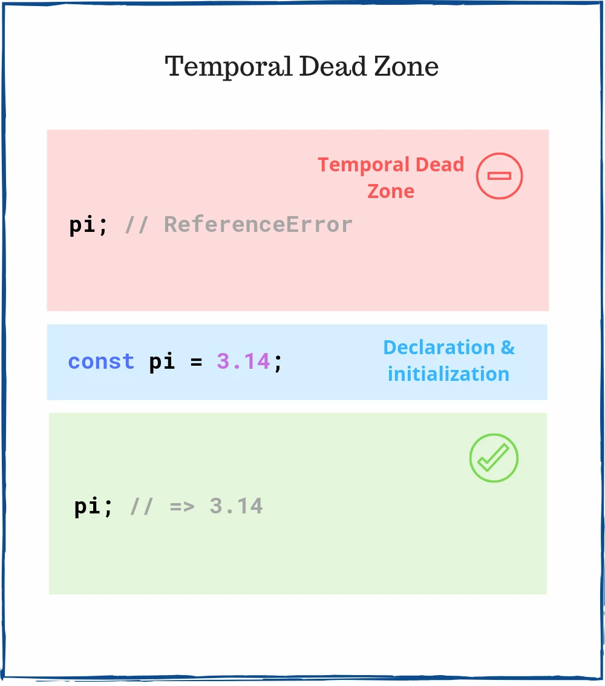

9월 프리온보딩 프론트엔드 챌린지 수강 도중 애매하게 알고 있었거나 새로이 알게된 정보 정리합니다.

<!--truncate-->

## 타입스크립트

### 타입스크립트 공식 문서

#### 1. soundness

- [건전성에 대한 참고 사항](https://www.typescriptlang.org/docs/handbook/type-compatibility.html#a-note-on-soundness)
- 건전성. 형식 체계 내에서 증명 가능한 명제가 의미론 상으로도 참이 되는 성질.
- 타입스크립트에는 soundness가 있는데 대표적으로 type assertion 이 있다.
- `const usersAge = ("23" as any) as number;`
- 타입스크립트는 런타임에 개입하지 않기 때문에 (이는 soundness 특성 때문) 개발자는 Narrowing으로 타입을 좁혀주어야 한다.

#### 2. unknown

- 이 타입이 어떤 타입인지 개발자도 아직 모를 때
- any와 비슷하지만 unknown의 가장 큰 특징은 에러를 발생시킨다는 것에 있다.
- 타입가드를 사용하자.

```ts
let num: unknown = 99;

if (typeof num === 'string') {
  num.trim();
}

(num as string).trim();
```

```ts
const jsonParserUnknown = (jsonString: string): unknown =>
  JSON.parse(jsonString);

type User = { name: string };
const myUserAccount = jsonParserUnknown(`{ "name": "Samuel" }`) as User;
myUserAccount.name;
```

#### 3. 구조적 서브 타이핑을 기반으로 하는 타입스크립트

**구조적 타입**

- 사실 타입스크립트의 타입은 집합의 일부일 수 있다. 즉 언어가 집합의 관계를 따진다.
- 객체가 어떤 속성들을 가지는지 구조를 기준으로 타입을 따진다.
- 타입의 생김새가 오리와 같다면 바로 오리의 타입임을 뜻한다.
  - 오리처럼 보이고, 오리처럼 수영하고, 오리처럼 꽥꽥거리면 그것은 오리일 것이다.
  - 거위가 오리와 같은 속성을 가지고 있다면 그것조차도 오리 타입
  - 일반적으로 동적 타입 시스템을 설명하는 데 덕 타이핑이 사용된다.

**명목적 타입**

- 각 타입이 고유하다는 것을 의미.
- 즉 동일한 타입이나 데이터가 있더라도 타입을 공유할 수 없다.
- 이름 기반으로 타입을 따진다
- 작성한 타입이 런타임에 존재한다.
- C#, Java

### 타입스크립트 활용

#### 1. TS 컨벤션 참조 사이트

- [google typescript style guide](https://google.github.io/styleguide/tsguide.html)
- [typescript 코딩 지침 (기여자용)](https://github.com/microsoft/TypeScript/wiki/Coding-guidelines)

#### 2. 어떤 객체의 value가 false값만 들어온다면, 타입스크립트로도 최대한 좁혀서 사용한다.

- 어떤 todo가 만들어질 때, 처음에 `isCompleted`는 무조건 false로 들어온다.

```ts
interface CreateTodo {
  id: string;
  content: string;
  // highlight-next-line
  isCompleted: boolean; // <- 여기
  category?: string;
  tags?: string[];
}

const createTodo = ({ content, category, tags }: CreateTodo): CreateTodo => {
  return {
    id: String(new Date()),
    isCompleted: false,
    content,
    category,
    tags,
  };
};
```

- 위 코드의 isCompleted는 boolean으로 타입지정이 되어있지만 이는 좋은 코드가 아니다.

```ts
interface CreateTodo {
  id: string;
  content: string;
  // highlight-next-line
  isCompleted: false;
  category?: string;
  tags?: string[];
}

const createTodo = ({ content, category, tags }: CreateTodo): CreateTodo => {
  return {
    id: String(new Date()),
    isCompleted: false,
    content,
    category,
    tags,
  };
};
```

- 확장을 사용하여 위 코드보다 더 좋게 만들어보자.

```ts
interface Todo {
  id: string;
  content: string;
  // highlight-next-line
  isCompleted: boolean;
  category: string;
  tags: string[];
}

interface CreateTodo extends Todo {
  // highlight-next-line
  isCompleted: false;
}

const createTodo = ({ content, category, tags }: CreateTodo): CreateTodo => {
  return {
    id: String(new Date()),
    isCompleted: false,
    content,
    category,
    tags,
  };
};
```

#### 3. 자주 사용하는 type은 최대한 재활용해서 쓰는 게 좋다.

```ts
interface Todo {
  // highlight-next-line
  id: string;
  content: string;
  isCompleted: boolean;
  category?: string;
  tags: string[];
}

interface DeleteTagParamsType {
  // highlight-next-line
  id: string;
  tagIdx?: number;
}
```

- 위 코드의 문제는, id가 string이 아닌 다른 타입으로 바뀔 때 일어난다.
  아래처럼 바꾼다면 좀 더 안정적으로 타입을 지정할 수 있다.

```ts
interface Todo {
  id: string;
  content: string;
  isCompleted: boolean;
  category?: string;
  tags: string[];
}

interface DeleteTagParamsType {
  // highlight-next-line
  id: Todo['id'];
  tagIdx?: number;
}
```

- 이렇게 하면 id의 타입이 바뀌어도 손쉽게 수정할 수 있다.
- 아래처럼 typescript 유틸리티를 사용할 수도 있다. (Omit, Pick...)

```ts
interface Todo {
  id: string;
  content: string;
  isCompleted: boolean;
  category?: string;
  tags: string[];
  tagIdx?: number;
}

type shoppingItem = Pick<Todo, 'tagIdx'>;
```

- 확장을 사용할 수도 있다.

```ts
interface Todo {
  id: string;
  content: string;
  isCompleted: boolean;
  category?: string;
  tags: string[];
}

interface DeleteTagParamsType extends Todo {
  tagIdx?: number;
}
```

#### 4. 함수형 type을 지정할때 void가 return 되는 type이 많다면, 한 번 의심해보는 게 좋다.

- 함수가 너무 많은 일을 하고 있을 수 있으므로 점검해보자

#### 5. 매개변수에 id 등을 넣을 때, 그냥 id를 쓰기보다 가능한 어떤 id인지 매개변수명으로 명시하면 좋다.

```js
deleteTodo(selectedId) {
  this.todoList = this.todoList.filter(({id})=> id !== selectedId)
}
```

#### 6. any와 다를 바 없는 타입 지정을 피하자

```ts
const $app: HTMLElement = document.createElement('div'); // 좋지 않음

const $app: HTMLDivElement = document.createElement('div'); // 이렇게 하자
```

#### 7. 타입을 좁힐 때 리터럴 타입을 적절히 이용한다.

- 아래와 같이 Route를 상수로 정의한 객체가 있다고 하자.

```ts
const Route = {
  ABOUT: '/about',
  TOPICS: '/topics',
};

function changeRoute(newPath: string) {
  const state = { page_id: 1, user_id: 5 };
  const title = '';

  history.pushState(state, title, newPath);
}

window.addEventListener('popstate', () => changeRoute('/auth'));
```

- newPath를 string으로 받으면, changeRoute에 존재하지 않는 route를 넣어도 typescript는 잡아주지 못한다.
- 이럴 때 리터럴 타입을 이용한다.

```ts
const Route = {
  ABOUT: '/about',
  TOPICS: '/topics',
};

type RoutePaths = 'about' | 'topics';

function changeRoute(newPath: RoutePaths) {
  const state = { page_id: 1, user_id: 5 };
  const title = '';

  history.pushState(state, title, newPath);
}

window.addEventListener('popstate', () => changeRoute('/auth'));
// Argument of type '"/auth"' is not assignable to parameter of type 'RoutePaths'.(2345)
```

- 라우트가 너무 많을 땐 다음처럼 응용할 수 있다.

```ts
const Route = {
  ABOUT: '/about',
  TOPICS: '/topics',
} as const;

type RoutePaths = typeof Route[keyof typeof Route];

function changeRoute(newPath: RoutePaths) {
  const state = { page_id: 1, user_id: 5 };
  const title = '';

  history.pushState(state, title, newPath);
}

window.addEventListener('popstate', () => changeRoute('/about'));
```

## 자바스크립트

#### 1. new.target

[mdn](https://developer.mozilla.org/ko/docs/Web/JavaScript/Reference/Operators/new.target)

> new.target 속성(property)은 함수 또는 생성자가 new 연산자를 사용하여 호출됐는지를 감지할 수 있습니다.

- 우리는 사용자를 위해 일부러 에러를 낼 수 있지만, 동료 개발자를 위해 에러를 낼 줄도 알아야 한다.
  예를 들어, 생성자를 사용하여 init 코드를 써야만 한다고 해보자. 동료 개발자가 이를 쓰지 않았을 때, 에러를 내주어야 한다.
  이럴 때 쓸 수 있는 것이 `new.target` 이다.

  ```js
  function Foo() {
    if (!new.target) {
      throw 'Foo() must be called with new';
    }
  }

  try {
    Foo();
  } catch (e) {
    console.log(e);
    // expected output: "Foo() must be called with new"
  }
  ```

#### 2. TDZ


[mdn](https://developer.mozilla.org/en-US/docs/Web/JavaScript/Reference/Statements/let#temporal_dead_zone_tdz)

- 일시적인 사각지대
- TDZ는 let, const, class 구문의 유효성을 관리한다.
- TDZ는 선언 전에 변수를 사용하는 것을 허용하지 않는다.
- var, function 선언은 TDZ에 영향을 받지 않는다. 이것들은 현재 스코프에서 호이스팅 된다.
- var 변수는 선언 전에도 사용할 수 있기 때문에 var 사용은 피하는 것이 좋다.

  ```js
  new Car('red'); // Uncaught ReferenceError: Car is not defined

  class Car {
    constructor(color) {
      this.color = color;
    }
  }
  ```

  ```js
  greet('World'); // 'Hello, World!'

  function greet(who) {
    return `Hello, ${who}!`;
  }
  ```

  - 위 코드에서 `new Car('red')`는 사각지대에 있는 셈.

#### 3. 매개변수가 3개 이상이 되면 객체로 넘겨주자

#### 4. 조건부 요소로 배열을 초기화하기

1. 삼항 연산자를 사용하여 배열 내부에 새로운 배열을 spread.

```js
const myArray = ['a', 'b', 'c', 'd', ...(condition ? ['e'] : [])];
// condition이 true면 e가 추가되고, false면 배열에 아무것도 추가되지 않음
```

2. 거짓값 필터링

```js
const myArray = ['a', 'b', 'c', 'd', condition ? 'e' : null].filter(Boolean);
```

```js
const myArray = ['a', 'b', 'c', 'd', condition ? 'e' : null].filter(
  (x) => x !== null
);
```

#### 5. shorthand properties (프로퍼티 축약)

- 프로퍼티의 key 와 value 에 할당할 변수명이 동일한 경우 value 를 생략 가능합니다.

#### 6. concise methods (간결한 메소드)

- 콜론과 함수 키워드를 생략한 간결한 문법

#### 7. 스위치문엔 default를 사용해 엣지케이스(방어코드)를 꼭 넣어주자.

> 엣지케이스 : 알고리즘이 처리하는 데이터의 값이 알고리즘의 특성에 따른 일정한 범위를 넘을 경우에 발생하는 문제

```js
default: {
  throw new Error ('what Id?')
}
```

#### 8. if문을 너무 깊게 쓰기보다, 한 번 빼서 분리하는 게 좋다

#### 9. if문으로 숫자의 boolean을 판별할 때 유의한다.

```js
if(!id) { // dangerous!!!
	...
}
```

```js
!!0; //false
!!-1; //true
```

## CS

#### 1. 풀 사이클

- 개발팀이 우수한 생산성 도구를 활용하여 소프트웨어 개발 수명주기(디자인, 개발, 테스트, 배포, 운영, 지원) 전체를 처리하는 모델

#### 2. throw Error()를 쓰는 경우와 console.error()를 쓰는 경우가 있는데 어떻게 쓰는게 좋을지 잘 모르겠어요.

- console은 애초에 webpack이나 빌드 시스템에서 걸러내야한다.
- console은 시스템 메모리를 잡아먹기 때문에, console을 쓴다는 것은 클라이언트의 메모리를 잡아먹겠다는 것

## Reference

- [구조적 타입](https://typescript-kr.github.io/pages/type-compatibility.html)
