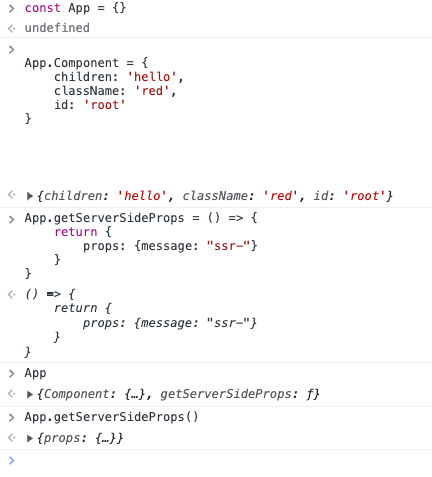

10월 프리온보딩 프론트엔드 챌린지 수강 도중 애매하게 알고 있었거나 새로이 알게된 정보 정리합니다.  
문서가 길어져서 나누어서 작성합니다.
이 문서는 React, Next에 대해 말하고 있습니다.

<!--truncate-->

## React

### 1. JSX.Element, React.ReactElement, React.ReactNode 의 차이

ReactNode > ReactElement > JSX.Element

#### ReactNode

[ReactNode](https://github.com/facebook/react/blob/main/packages/shared/ReactTypes.js)

```ts
export type ReactNode =
  | React$Element<any>
  | ReactPortal
  | ReactText
  | ReactFragment
  | ReactProvider<any>
  | ReactConsumer<any>;
```

ReactNode는 ReactElement의 superset.
ReactNode는 ReactElement를 비롯하여 대부분의 자바스크립트 데이터 타입을 아우르는 범용적인 타입.
따라서 어떤 props을 받을 건데, 구체적으로 어떤 타입이 올지 알 수 없거나, 어떠한 타입도 모두 받고 싶다면 ReactNode로 지정해주는 것이 좋다.

#### ReactElement

[ReactElement](https://github.com/facebook/react/blob/main/packages/shared/ReactElementType.js)

```ts
export type Source = {
  fileName: string,
  lineNumber: number,
};

export type ReactElement = {
  $$typeof: any,
  type: any,
  key: any,
  ref: any,
  props: any,
  // ReactFiber
  _owner: any,

  // __DEV__
  _store: {validated: boolean, ...},
  _self: React$Element<any>,
  _shadowChildren: any,
  _source: Source,
};
```

ReactElement는 type과 props 등을 가진 객체.
React.createElement 함수를 통해 완성된 객체(컴포넌트)만을 허용하는 타입.

#### JSX.Element

```ts
declare global {
  namespace JSX {
    interface Element extends React.ReactElement<any, any> {}
  }
}
```

ReactElement의 특정 타입.
JSX.Element는 props와 type이 any인 제네릭 타입을 가진 ReactElement.
JSX는 글로벌 네임 스페이스에 있기 때문에 다양한 라이브러리에서 자체 라이브러리의 방법대로 실행될 수 있다.

### 2. Universal Rendering

- 하나의 환경에서 SSR과 CSR을 함께 지원하는 것
- 서버 측 React(`react-dom/server`)에서 한번 앱을 렌더링.
- 문자열로 변환(`serialization`) 후 클라이언트 쪽으로 넘긴다.
- 클라이언트는 한번 더 렌더링을 하긴 하지만, 넘겨 받은 결과물에 JavaScript 이벤트 리스너를 연결하는 동작을 한다. 이를 `hydration(수화)`라고 함.

#### Hydrate는 왜 해주는 것일까?

- 어떤 객체를 HTTP 통신에서 body 값으로 활용하려면 JSON.stringify() 를 사용해 문자로 변환해주어야 함. -> 버석버석한 **직렬화**
- 이때 자바스크립트 함수는 직렬화 되지 않는다.
- 직렬화를 거치고 함수가 사라져버리면, UI는 존재하나 클릭 같은 이벤트리스너 함수가 동작하지 않게 된다. 그렇기 때문에 기능이 동작하도록 촉촉하게 **Hydrate** 해주어야 한다.
- `hydrate`를 사용하면 `클라이언트 측 React`는 서버 측에서 React로 렌더링 된 HTML을 읽고, 원래 이벤트 리스너가 달려 있어야 하는 DOM들의 위치를 찾아 이벤트 리스너를 달아준다.
- 클라이언트 앱 구동에 필요한 자바스크립트 번들 크기가 클수록 다운로드 / 실행할 자바스크립트 양이 많아지므로 TTI(Time To Interactive)는 늦어지게 된다.

#### React에서의 SSR

- [예제코드](https://github.com/saengmotmi/vite-csr-ssr-example/blob/master/index.html)

**1. index.html**

```html title="index.html"
<html lang="en">
  <head>
    <script type="text/javascript">
      // highlight-next-line
      window.__INITIAL_DATA__ = __DATA_FROM_SERVER__;
    </script>
  </head>
  <body>
    <div id="root"></div>
    <script type="module" src="/src/main.tsx"></script>
  </body>
</html>
```

- `__DATA_FROM_SERVER__`는 서버에서 넣어주는 초기값이 있을 경우 채워진 뒤, React 앱 쪽에서 읽어오는 방식으로 사용하게 된다.

**2. 서버 측**

```ts
let indexHTML = fs.readFileSync(
  path.resolve(__dirname, 'dist/index.html'),
  'utf8'
);
```

- `dist/index.html`을 서버측에서 읽고

```ts
const result = ReactDOM.renderToString(<About />);
indexHTML = indexHTML
  .replace(
    '<div id="root"></div>', // replace the placeholder
    `<div id="root">${result}</div>` // replace with the actual content
  )
  .replace('__DATA_FROM_SERVER__', JSON.stringify(initialData)); // head script에 server 측 주입
```

- `<About/>` 컴포넌트를 직렬화하여, `${result}` 자리에 갈아 끼운 뒤, `__DATA_FROM_SERVER__`에 갈아끼운다.

```ts
return res.status(200).send(indexHTML);
```

- `return res.status(200).send(indexHTML)` 에서 최종적으로 서버 응답을 내보낸다.

**3. 클라이언트 측**

```tsx
// highlight-next-line
const initialData = (window as any).__INITIAL_DATA__;

// highlight-next-line
ReactDOM.hydrateRoot(
  container,
  <Router>
    {routes.map(({ path, component: Component }) => (
      <Route
        key={path}
        path={path}
        component={<Component state={initialData} />}
      />
    ))}
  </Router>
```

- HTML는 이미 로드되어 있음.
- 서버에서 가져온 데이터는 head 태그 내의 script 태그를 통해 자바스크립트 객체로 변환되어, window 객체의 멤버 변수로 등록된 상황.
- **이벤트 리스너만 달아주는 `hydrateRoot` 를 사용.**

#### ReactDOMClient API

- [ReactDOMClient](https://ko.reactjs.org/docs/react-dom-client.html)
- `createRoot().render()` - 17버전까지의 `render()` 역할
  - 클라이언트에서 다시 처음부터 렌더링을 한다. CSR.
- `hydrateRoot()` - 17버전까지의 `hydrate()` 역할
  - 서버에서 이미 모두 그렸으므로, `hydrate`을 하여 이벤트리스너를 붙인다. SSR.

#### ReactDOMServer API

- [ReactDOMServer](https://ko.reactjs.org/docs/react-dom-server.html)
  - SSR으로 쓰인다
- `renderToString()` ⇒ React 컴포넌트를 직렬화하여 문자열로 변환 (ex. 구글맵 마커) / Suspense를 지원하지 않는 동기 렌더링 함수.

## NextJS

### 1. API Route

- API Routes 는 pages/api 디렉토리 내에 정의하며 파일 시스템을 기반으로 주소가 결정된다.
  (Next create 시, 이미 만들어져 있을 것)
- 서버 측 전용 번들이고, 클라이언트 측 번들 크기를 늘리지 않는다.
- URL은 `domain/api/name` 형태로 작성된다.
- 핸들러는 2개의 인수를 받는다(request, response)
  NextJS는 request를 해당 URL(domain/api/name)에 보내기 위해 핸들러를 실행한다.
- 서버사이드에서 진행할 작업에 대한 내용만 작성하면 된다. 클라이언트 사이드에서 노출되지 않는다.

#### API Route 장점

#### 1. 엔드포인트 은닉

외부 API 주소를 마스킹 할 수 있다. (예: `https://company.com/secret-url` -> `/api/secret`)

```js
// pages/api/secret-url

import { NextApiRequest, NextApiResponse } from 'next';

const API_BASE_URL = process.env.API_BASE_URL;

export default async function handler(
  req: NextApiRequest,
  res: NextApiResponse
) {
  const requestUrl = `${API_BASE_URL}/${req.path}`;
  const response = await fetch(requestUrl);
}
```

#### 2. 유효성 검사

```js
import { NextApiRequest, NextApiResponse } from 'next';

export async function handler(req: NextApiRequest, res: NextApiResponse) {
  const role = req.headers.get('authorization');

  if (['user', 'admin'].includes(role)) {
    return res.status(401).send('unauthorized');
  }

  // ...
}
```

#### 3. 데이터 커스텀을 할 수 있다.

#### 4. cors 에러가 나지 않는다.

- next라는 출처가 같아서 cors 에러를 피할 수 있다.

#### 5. BFF에 편하다

- 프론트엔드 앞단에 백엔드 서버를 놓는 것.
- 이렇게 하면 프론트엔드가 api 서버를 찌르는 게 아니라, 같이 있는 백엔드 서버에 요청한다. 그러면 BFF 서버가 API 요청을 대신 한다.
- BFF로 그래프큐엘로 요청 받는 것이 가능.
- 일종의 프록시 서버 느낌.

### 2. \_document 에서 style을 왜 넣어주는 걸까?

- styled-components 라이브러리를 설치한 후, 사용해보려고 하면 스타일이 적용되기 전에 화면이 렌더되고 만다.
- 이는 SSR에서 스타일을 입히는 과정을 생각해보면 너무나 당연하다.
- 렌더링 과정을 생각해보자. `DOM + SSOM = 렌더트리`가 되어야 하는데, DOM은 있지만 SSOM이 없다.
- JS가 로드되기 전까지 CSS가 그려지지 않으므로 처음에는 스타일이 적용되지 않은 채 적용된다.

```tsx title="_document"
class MyDocument extends Document {
  static async getInitialProps(ctx: DocumentContext) {
    // highlight-next-line
    const sheet = new ServerStyleSheet(); // <- 2. sheet에 할당
    const originalRenderPage = ctx.renderPage;
    try {
      ctx.renderPage = () =>
        originalRenderPage({
          enhanceApp: (App) => (props) =>
            // highlight-next-line
            sheet.collectStyles(<App {...props} />), // <- 1. style을 뽑아서
        });
      const initialProps = await Document.getInitialProps(ctx);
      return {
        ...initialProps,
        styles: (
          <>
            {initialProps.styles}
            {sheet.getStyleElement()} // <- 3. 이렇게 리턴해준다.
          </>
        ),
      };
    } finally {
      sheet.seal();
    }
  }
}
export default MyDocument;
```

### 3. next/image

#### 1. next로 만들어진 웹페이지의 이미지를 네트워크 탭에서 확인해보자.

- `https://example.vercel.app/_next/image?url=https%3A%2F%2Fsubstackcdn.com%2Fimage%2Ffetch%2Fw_256.....`
- `url/_next/image/쿼리스트링`

#### 2. 디코딩해보자

- decodeURLComponent(`https://example.vercel.app/_next/image?url=https%3A%2F%2Fsubstackcdn.com%2Fimage%2Ffetch%2Fw_256.....`)
- substackcdn.com 에 있는 이미지였다.

#### 3. 왜 내 서버를 통해서 이미지가 응답이 올까?

- 이미지가 넥스트 서버를 거쳤기 때문이다.
- 넥스트는 이미지 최적화를 해준다.

#### 4. 이미지 크기가 충분히 작은데도 거쳐서 올 필요가 있을까?

- Next는 이미지에 블러, placeholder 속성도 준다.
- 한 번 최적화를 거친 컨텐츠는 넥스트 서버가 메모리에 갖고 있다.
- 이는 다른 유저가 접속했을때 더 빠르게 이미지를 받아볼 수 있다는 것이다

### 4. getServerSideProps

- `getServerSideProps`를 export만 했을 뿐인데 어떻게 서버 사이드에서 실행되고 그 리턴 값이 컴포넌트의 props 값으로 연결되는 것일까?
- `getServerSideProps`를 export하면 **Next가 이것을 가져가서** 서버에서 실행한 뒤 return 한다.

;

```jsx title="/next/server/load-components.ts"
// highlight-next-line
const ComponentMod = await Promise.resolve().then(() =>
  requirePage(pathname, distDir, serverless, isAppPath)
);

const [buildManifest, reactLoadableManifest, serverComponentManifest] =
  await Promise.all([
    require(join(distDir, BUILD_MANIFEST)),
    require(join(distDir, REACT_LOADABLE_MANIFEST)),
    hasServerComponents
      ? require(join(distDir, 'server', FLIGHT_MANIFEST + '.json'))
      : null,
  ]);

const Component = interopDefault(ComponentMod);
const Document = interopDefault(DocumentMod);
const App = interopDefault(AppMod);
// highlight-next-line
const { getServerSideProps, getStaticProps, getStaticPaths } = ComponentMod;
```

- `requirePage` 라는 함수에 경로를 넘겨주고 페이지 컴포넌트를 가져온다.
- 리턴 값 중 서버 사이드 관련 메서드를 별도로 뽑아낸다.

```tsx title="/next/server/render.tsx"
try {
  // highlight-next-line
  data = await getServerSideProps({
    req: req as IncomingMessage & {
      cookies: NextApiRequestCookies
    },
    res: resOrProxy,
    query,
    ...
  })
```

- 뽑아낸 메서드를 실행시켜 data 변수에 담은 뒤, 서버 측에서 React 컴포넌트 렌더링 시 props로 전달한다.
- 직렬화 가능한 형태의 값만 넣어줘야 하는 이유 : 서버에서 클라이언트로 이동시켜야 하기 때문이다.
- 마치 마술 같지만 모든 마술은 트릭이 있다.

## CS

### 1. 무중단 배포 3가지 방식

[무중단 배포](https://loosie.tistory.com/781)

서비스 중단 없이 새로운 버전을 계속 배포할 수 있는 방법

- 롤링(Rolling Update) 방식
- 블루 그린(Blue-Green Deployment) 방식
- 카나리(Canary Release) 방식

### 멱등성이란?

- 여러 번 요청 해도 같은 값이 오는 것
- 연산을 여러 번 적용하더라도 결과가 달라지지 않는 성질
