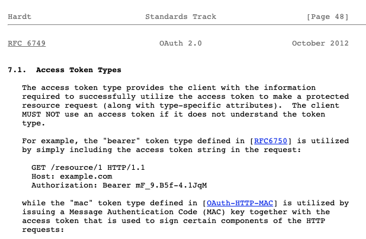

[2023년 3월 프리온보딩 프론트엔드 챌린지](https://www.wanted.co.kr/events/pre_challenge_fe_7) 수강 도중 애매하게 알고 있었거나 새로이 알게된 정보 정리합니다.

강의를 들으면서 따로 조사해 덧붙인 내용도 있습니다.

<!--truncate-->

## Week 1-1

### FormData API

[도움되는 아티클](https://dev.to/kuvambhardwaj/i-was-creating-forms-the-wrong-way-all-along-in-reactjs-hl3)

- 여기서 유효성 검사는 [pattern 속성](https://developer.mozilla.org/en-US/docs/Web/HTML/Attributes/pattern)을 추천 한다.

<iframe
  width='100%'
  height='400px'
  src='https://codesandbox.io/embed/formdata-forked-5ebfsh?fontsize=14&hidenavigation=1&theme=dark'></iframe>

:::note

FormData에 속하는 필드는 아래와 같은 메서드로 수정할 수 있습니다.

formData.append(name, value) – name과 value를 가진 폼 필드를 추가

formData.append(name, blob, fileName) – `<input type="file">`형태의 필드를 추가.
세 번째 인수 fileName은 (필드 이름이 아니고) 사용자가 해당 이름을 가진 파일을 폼에 추가한 것처럼 설정해줌

formData.delete(name) – name에 해당하는 필드를 삭제

formData.get(name) – name에 해당하는 필드의 값을 가져옴

formData.has(name) – name에 해당하는 필드가 있으면 true를, 그렇지 않으면 false를 반환

[출처](https://ko.javascript.info/formdata): 모던 JavaScript

:::

🐣: form + input 조합 같은 경우 useState, useRef를 쓰는 경우가 많은데, new FormData로 쓸 때의 이점이 있나요?

🦊: 우선 `useState`는 input의 onChange가 일어날 때마다 리렌더링 된다. 이를 막기 위해 디바운스를 주든지 부가기능을 붙여야 한다. `useRef`는 `FormData API`와 성능적으로 큰 차이가 없지만 FormData를 썼을 때 좀 더 가볍게 처리할 수 있다. 또 코드의 가독성도 생긴다. (시멘틱해지기 때문에)

---

🐣: formData를 콘솔에 찍어보니 `FormData{append: ƒ append(), delete: ƒ delete(), get: ƒ get(), getAll: ƒ getAll(), has: ƒ has()…}`가 뜨는 반면, formData.get을 하면 안의 값이 정상적으로 나옵니다. 브라우저 콘솔에서 FormData{} 아래의 값을 확인하는 방법이 있을까요?

🦊: 브라우저 콘솔로 확인하기 어려울 것이다. [FormData.entries()](https://developer.mozilla.org/en-US/docs/Web/API/FormData/entries)로 확인하시길.

---

## Week 1-2

### 이론

0. HTTP란 하이퍼텍스트를 주고받는 `프로토콜`이다.
1. 한 번 로그인하고 난 뒤, 신원 확인이 필요한 API를 쏠 때 Header에 authentication을 붙여주지 않고 요청을 하면 왜 그 사람이 누구인지 모르는 거죠?
   - HTTP 요청은 각각 개별적이며 그렇기 때문에 Header에 authentication을를 붙여주지 않으면 신원확인을 할 수 없다. http는 stateless(무상태)하고 connectionless(비연결성)하다.
2. Base64란?
   - `Base64`란 인코딩 규격이다. Binary Data를 Text로 변경하는 Encoding이다.
   - 인코딩은 다른 형태나 형식으로 변환하는 처리 혹은 그 처리 방식을 말한다.
3. 토큰이란?
   - [웹 표준](https://www.rfc-editor.org/rfc/rfc7519)으로서 이야기하고 있는 하나의 토큰이다.
4. JWT의 토큰 값 구하는 방식
   - 해시함수(헤더 + 페이로드 + 해싱 시크릿키) -> 토큰의 값
   - 백단에서 이 토큰값이 유효한 값인지 확인하는 법: 클라이언트가 보낸 토큰값에서 헤더, 페이로드를 떼고 서버에 있는 시크릿키로 다시 만들어 비교한다.
5. 그래서 토큰을 어디에 저장해야 하는가?

   - 비용과 상황에 따라 다르다. 답이 있는 문제가 아님.
   - 토큰을 런타임 메모리에 저장하면 절대 탈취할 수 없겠지만 매번 로그인해주어야 한다. (로그인 유지 불가)
   - 로컬스토리지에 담으면 XSS에 취약하다. react는 특히 `dangerouslySetInnerHTML` 어트리뷰트가 있는데 특히 더 [주의](https://ko.reactjs.org/docs/dom-elements.html#dangerouslysetinnerhtml)해야 한다.
     :::note
     XSS란 웹사이트 관리자가 아닌 이가 웹 페이지에 악성 Script를 삽입할 수 있는 취약점이다.
     `` 이런식으로 스크립트를 삽입해 탈취할 수 있다.
     :::

   - 쿠키에 담으면 CSRF에 취약하다
     :::note
     CSRF란 사용자가 자신의 의지와는 무관하게 공격자가 의도한 행위를(수정, 삭제, 등록) 특정 웹사이트에 요청하게 하는 공격이다.

     1. 이용자는 웹사이트에 로그인하여 정상적인 쿠키를 발급받는다
     2. 공격자는 `http://www.geocities.com/attacker` 같은 링크를 이메일이나 게시판 등의 경로를 통해 이용자에게 전달한다.
     3. 공격용 HTML 페이지는 다음과 같은 이미지태그를 가진다.
        ``
        해당 링크는 클릭시 정상적인 경우 출발지와 도착지를 등록하기 위한 링크이다. 위의 경우 도착지를 변조하였다.

     4. 이용자가 공격용 페이지를 열면, 브라우저는 이미지 파일을 받아오기 위해 공격용 URL을 연다.
     5. 이용자의 승인이나 인지 없이 출발지와 도착지가 등록됨으로써 공격이 완료된다. 해당 서비스 페이지는 등록 과정에 대해 단순히 쿠키를 통한 본인확인 밖에 하지 않으므로 공격자가 정상적인 이용자의 수정이 가능하게 된다.

6. 방어법

   - httponly cookie를 해주고, access token, refresh token으로 방어한다.

7. authentication 앞에 `bearer`를 왜 붙이는 거죠. 심지어 하드코딩을 하는군요!

   - 이 역시도 [RFC 6749](https://www.rfc-editor.org/rfc/rfc6749)에 정의되어 있다. 일종의 통신규약.
     

8. cURL란 통신 프로토콜을 이용해 URL로 데이터를 전송하여 서버에 데이터를 보내거나 가져올때 사용하기 위한 명령줄 도구 및 라이브러리다. 여기서 `c`는 command line의 약자다.

## Week 2-1

### 이론

#### 세션

1. 세선: 사용자의 로그인 이후, 로그아웃 혹은 로그인 만료까지의 기간
2. 세션 방식 로그인: 사용자 로그인이 유효한 시간 동안 서버에서 세션 아이디를 기록해두고 인증에 사용하는 방식
   - 세션 아이디를 기록하는 법: 쿠키

#### 쿠키

1. [쿠키](https://developer.mozilla.org/ko/docs/Web/HTTP/Cookies): 서버에서 사용자의 웹 브라우저로 보내는 데이터 조각. 브라우저는 데이터 조각을 저장했다가 동일한 서버에서 요청 시 저장된 데이터를 함께 전송함
2. 쿠키는 프론트엔드가 직접 넣어주는 게 아님.
3. 쿠키 관련 정책 지정
   - SameSite: None, Lax, Strict
   - HttpOnly
   - Secure (이 옵션을 쓸 땐, 로컬호스트에서 문제가 생길 수 있으므로 유의한다. 로컬은 http를 사용하기 때문이다. 프로덕션 환경에서만 작동하게 하는 등의 방법으로 사용)
   - [cookie-playground](https://github.com/leejh3224/cookie-playground)에서 쿠키를 가지고 놀아볼 수 있음

#### 세션 vs JWT

1. JWT: 서버/백엔드 비용 감소. 프론트엔드 복잡도 높아짐. 보안상 세션보다 좀 더 위험
2. 세션: 서버/백엔드 비용 증가. 프론트엔드 인증 쉬워짐. 보안상 약간 향상
3. 서비스 상황에 따라 선택하자. 동시접속자 수, 서비스 규모, 앱&웹 동시 운용 여부, 팀 내 인력구성, 일정 등...

## Q&A

🐣: `_secret`처럼 변수명에 언더스코어를 붙이는 의미(네이밍 컨벤션)가 무엇인가요?

🦊: 사실 언더스코어는 시스템, 혹은 객체지향 프로그래밍, 클래스를 만들 때 주로 쓰인다. \_를 붙인다는 것은 스코프 안에서 private하게 쓰겠다는 의미이다. 즉, 비밀스러운 변수.

[더 참고하고 싶다면 읽어보자](https://mingrammer.com/underscore-in-python/)

---

🐣: 보다 일찍 return 을 해줘버리는 걸 뭐라고 하나요?

🦊: ealry return 이라고 한다. 말 그대로 return을 빨리해서 뒷 코드의 구조를 단순하게 만들어준다. 이렇게 하면 else를 제거할 수 있다.

---

🐣: 위치에 따른 로그인 인증 방법을 구현하고 싶은데, vpn은 사용자의 접속 위치를 변경하잖아요? 어떻게 구현하는게 좋을까요?

🦊: 위험함. 클라이언트에서는 특히 하지 마라.

---

🐣: API 다루는 게 너무 어렵습니다. API 실습을 위해서 백엔드도 따로 공부해야 할까요?

🦊: [샘플 API](https://sampleapis.com/)를 추천한다.

---

### 그밖의 메모

meta 태그의 og 는 open graph의 약어로, 어떤 HTML 문서의 메타정보를 쉽게 표시하기 위해 메타정보에 해당하는 다양한 요소들에 대해 사람들이 통일해서 쓸 수 있도록 정의한 프로토콜이다.
