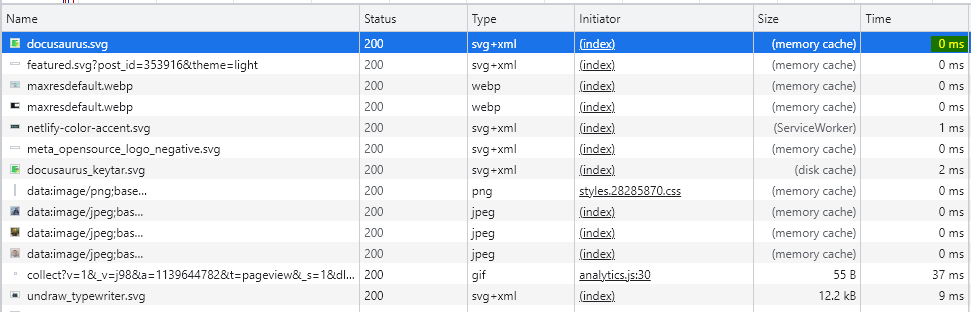
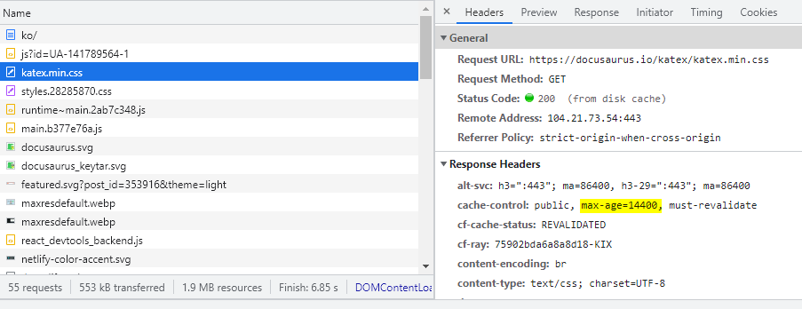
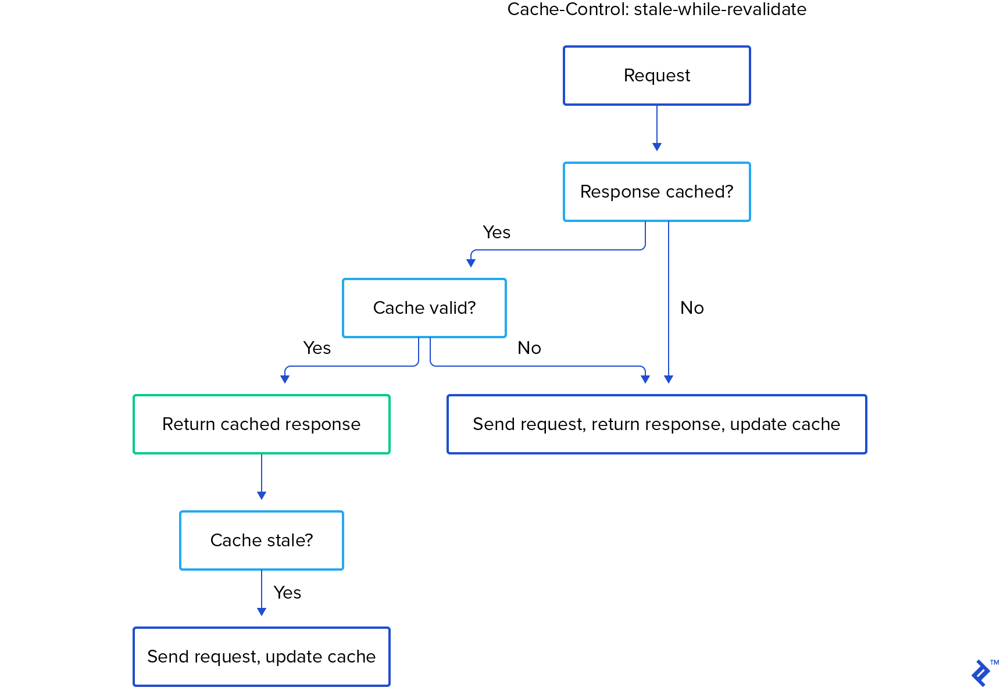

## stale-while-revalidate?

> **The stale-while-revalidate Cache-Control Extension**  
> When present in an HTTP response, the stale-while-revalidate Cache-Control extension indicates that caches MAY serve the response in which it appears after it becomes stale, up to the indicated number of seconds.

> 캐시된 응답이 오래된 것일 수 있다는 아이디어와 재검증 프로세스.

캐시란 자주 쓰이는 문서의 사본을 자동으로 보관하는 HTTP 장치다. 웹 요청이 캐시에 도착했을 때, 캐시된 로컬 사본이 존재한다면, 그 문서는 원서버가 아니라 캐시로부터 제공된다. 즉, 캐시된 콘텐츠를 즉시 로드하는 **즉시성**을 가지고 있다.

요즘 자주 들어가는 사이트인 `docusaurus`에 다시 들어가 보았다. 이곳의 Network를 확인해보자 이미지 외 다수가 (memory cache) 되어있고 즉시 가져온 것을 확인할 수 있었다.


_0ms로 가져온 모습_

오랜 시간 뒤, 이 웹 사이트를 다시 들어가본다고 하자. 그 사이에 docusaurus 사이트에서 문서를 업데이트 했다고 생각해보자. 그럼에도 브라우저가 오래된 캐시를 계속 가져온다면 우리는 오래된 문서를 볼 수밖에 없다. 오래된 것을 stale 하다고 이야기한다.

이처럼 원 서버 컨텐츠는 변경될 수 있기 때문에, 캐시는 반드시 그들이 갖고 있는 사본이 여전히 최신인지 서버를 통해 점검해야한다.

stale-while-revalidate는 캐시된 콘텐츠에 대한 업데이트가 향후에 사용되도록 보장하는 최신성 간의 균형을 유지하는 데 도움이 된다.



## 메커니즘

### '오래 되었다'는 기준은?

1. 요청이 처음 전송되면 브라우저에 의해 캐시된다.
2. 동일한 요청이 두 번째로 전송되면 캐시를 먼저 확인한다.
3. 해당 요청의 캐시가 **사용 가능**하고 **유효**한 경우 캐시가 응답으로 반환한다.
4. 그런 다음 캐시에 staleness(\*오래된)가 있는지 확인하고 staleness가 발견되면 업데이트된다.
   - 여기서 캐시의 staleness는 `Cache-Control Header`에 있는 `max-age`값과 `stale-while-revalidate`에 의해 결정된다.
   - max-age가 만료되지 않았다
     - 아무것도 하지 않음
   - max-age가 만료되었다.
     - `stale-while-revalidate` 확인,
     - `stale-while-revalidate` 가 만료되지 않았다면?
     - 캐시된 응답의 사용을 지연시키지 않는 방식으로 네트워크에 대해 "재검증" 요청이 이루어진다. 반환된 응답은 이전에 캐시된 응답과 동일한 정보를 포함하거나 다를 수 있다.
     - 어느 쪽이든 네트워크 응답은 로컬에 저장되어 이전에 캐시된 항목을 대체하고 향후 max-age 비교 중에 사용되는 "최신성" 타이머를 재설정한다.
   - `stale-while-revalidate`마저 넘었다면
     - 데이터를 새로 요청한다.


_출처:toptal_

## Server State와 UI State의 차이

이에 대해선 `tanstack-query`라이브러리가 잘 설명해주고 있다. 서버 상태 라이브러리 중 하나인 `tanstack-query`는 이처럼 이야기한다.

> React Query는 서버와 클라이언트 간의 비동기 작업을 관리 하는 서버 상태 라이브러리입니다.
> Redux, MobX, Zusstand 등은 비동기 데이터를 저장하는 데 사용할 수 있는 클라이언트 상태 라이브러리 이지만 React Query와 같은 도구와 비교할 때 비효율적입니다.

다음과 같은 전역 상태가 있다고 해보자.

```
const globalState = {
  projects,
  teams,
  tasks,
  users,
  themeMode,
  sidebarStatus,
}
```

이를 '서버 상태'와 'UI 상태'로 나누어보자면 다음과 같다.

```
const serverState = {
  projects,
  teams,
  tasks,
  users
}
```

```
const uiState = {
  themeMode,
  sidebarStatus,
}
```

서버에서 가져오는 데이터를 캐싱할 수 있는 `projects`, `teams`, `tasks`, `users` 상태는 언제든지 stale 해질 수 있지만, 다크모드 같은 스타일이나 사이드바의 여닫힘은 그렇지 않다.

## Reference

- [rfc](https://www.rfc-editor.org/rfc/rfc5861#section-3)
- [web.dev](https://web.dev/stale-while-revalidate/)
- [toptal](https://www.toptal.com/react-hooks/stale-while-revalidate)
- [tanstack](https://tanstack.com/query/v4/docs/guides/does-this-replace-client-state?from=reactQueryV3&original=https://react-query-v3.tanstack.com/guides/does-this-replace-client-state)
- [mdn](https://developer.mozilla.org/en-US/docs/Web/HTTP/Headers/Cache-Control)
