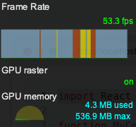

데이터를 **표시**한다는 것은 요소를 화면이나 다른 출력 장치에 렌더링하는 것을 의미한다.  
W3C는 프로그래밍 방식으로 요소를 렌더링하는 방식을 **문서 객체 모델(DOM)로 정의**했다.  
2장의 목적은 프레임워크 없이 DOM을 효과적으로 조작하는 방법을 배우는 데 있다.

## 문서 객체 모델(DOM)

DOM은 웹 애플리케이션을 구성하는 요소를 조작할 수 있는 API다.
[what is the DOM?](https://www.w3.org/TR/1998/WD-DOM-19980720/introduction.html)

1. 기술적 관점에서 보면 모든 HTML 페이지는 트리로 구성된다.

```html title="간단한 HTML 테이블"
<html>
  <body>
    <table>
      <tr>
        <th>Framework</th>
        <th>GitHub Stars</th>
      </tr>
      <tr>
        <td>Vue</td>
        <td>118917</td>
      </tr>
      <tr>
        // highlight-next-line
        <td>React</td>
        <td>115392</td>
      </tr>
    </table>
  </body>
</html>
```

```jsx title="React 셀의 색상 변경"
const SELECTOR = 'tr:nth-child(3) > td';
const cell = document.querySelector(SELECTOR);
cell.style.backgroundColor = 'red';
```

- 돔에 접근하여 backgroundColor를 바꿔주고 있다.

## 렌더링 성능 모니터링

- 웹용 렌더링 엔진을 설계할 때는 `가독성`, `유지 관리성`, `성능`을 고려한다.

### 크롬 개발자 도구

#### FPS(초당 프레임 수)

1. 개발자 도구
2. Cmd/Ctrl+Shift+P
3. Show frame per seconds(FPS) meter



- GPU에서 사용하는 메모리양이 표시된다.

### stats.js

[stats 라이브러리](https://github.com/mrdoob/stats.js)

- FPS 모니터링 라이브러리
- 프레임과 할당된 메가바이트의 메모리를 렌더링하는데 필요한 밀리초를 표시할 수 있음

## 렌더링 함수

순수 함수로 요소를 렌더링한다는 것은 DOM 요소가 애플리케이션의 상태에만 의존한다는 것을 의미한다.
순수 함수를 사용하면 테스트 가능성이나 구성 가능성 같은 많은 장점이 있지만 몇 가지 문제도 있다.

```
view = f(state)
```

**TodoMVC**

- [예제 템플릿](https://todomvc.com/examples/react/#/)

### 01. 순수함수 렌더링

#### 1. 결과

<iframe src="https://codesandbox.io/embed/trusting-flower-snq3b7?fontsize=14&hidenavigation=1&theme=dark"
  width='100%'
  height='400px'></iframe>

#### 2. html

```html title="index.html"
<body>
  // highlight-next-line
  <section class="todoapp">
    <!-- todoapp: targetElement 으로 접근할 요소 -->
    <header class="header">
      <h1>todos</h1>
      <input class="new-todo" placeholder="What needs to be done?" autofocus />
    </header>
    <section class="main">
      <input id="toggle-all" class="toggle-all" type="checkbox" />
      <label for="toggle-all">Mark all as complete</label>
      <ul class="todo-list"></ul>
    </section>
    <footer class="footer">
      <span class="todo-count">1 Item Left</span>
      <ul class="filters">
        <li>
          <a href="#/">All</a>
        </li>
        <li>
          <a href="#/active">Active</a>
        </li>
        <li>
          <a href="#/completed">Completed</a>
        </li>
      </ul>
      <button class="clear-completed">Clear completed</button>
    </footer>
  </section>
  <footer class="info">
    <p>Double-click to edit a todo</p>
    <p>
      Created by
      <a href="http://twitter.com/thestrazz86">Francesco Strazzullo</a>
    </p>
    <p>Thanks to <a href="http://todomvc.com">TodoMVC</a></p>
  </footer>
  <script type="module" src="index.js"></script>
</body>
```

#### 3. view.js

```js title="view.js"
const getTodoElement = (todo) => {
  const { text, completed } = todo;

  return `
  // highlight-next-line
  <li ${completed ? 'class="completed"' : ''}>
    <div class="view">
      <input 
        // highlight-next-line
        ${completed ? 'checked' : ''}
        class="toggle" 
        type="checkbox">
      <label>${text}</label>
      <button class="destroy"></button>
    </div>
    <input class="edit" value="${text}">
  </li>`;
};
// completed 여부에 따라서 class를 다르게 부여하거나 <input type='checkbox'/>를 checked로 주고 있다.

const getTodoCount = (todos) => {
  const notCompleted = todos.filter((todo) => !todo.completed);

  const { length } = notCompleted;
  if (length === 1) {
    return '1 Item left';
  }

  return `${length} Items left`;
};
// filter메서드를 이용해 남은 할일 개수를 세고 있다.

export default (targetElement, state) => {
  const { currentFilter, todos } = state;
  // 들어오는 매개변수 state는 currentFilter, todos를 obj로 갖고 있다.

  const element = targetElement.cloneNode(true);
  // targetElement(todoapp)를 복사하여 복제본 DOM을 수정할 것이다.

  const list = element.querySelector('.todo-list');
  const counter = element.querySelector('.todo-count');
  const filters = element.querySelector('.filters');

  list.innerHTML = todos.map(getTodoElement).join('');
  // 복제된 list에 todos를 끼워넣는다.
  counter.textContent = getTodoCount(todos);
  // getTodoCount 함수의 return 값이 'string'이었음을 기억하자.
  //counter.textContent에 남은 todo의 개수를 끼워넣는다.

  Array.from(filters.querySelectorAll('li a')).forEach((a) => {
    if (a.textContent === currentFilter) {
      a.classList.add('selected');
    } else {
      a.classList.remove('selected');
    }
  });

  return element;
};
```

- cloneNode를 하고 수정을 가했으므로 실제 DOM에게는 아무런 영향이 없다.

:::note

Node.cloneNode()
<small>Node.cloneNode() 메서드는 이 메서드를 호출한 Node 의 복제된 Node를 반환합니다. cloneNode(true) 일 경우 자식 노드를 함께 복사합니다.</small>
:::

:::note

Node.textContent
<small>Node.textContent는 노드와 그 자손의 텍스트 콘텐츠를 표현합니다.
innerText는 해당 Element 내에서 사용자에게 '보여지는' 텍스트 값을 읽어오지만, textContent는 텍스트가 숨겨져 있더라도 해당 노드가 가지고 있는 텍스트 값을 모두 읽습니다.</small>
:::

#### 4. 컨트롤러

```js title="index.js"
import getTodos from './getTodos.js';
// getTodos 파일은 fake 파일이다.
import view from './view.js';

const state = {
  todos: getTodos(),
  currentFilter: 'All',
};

const main = document.querySelector('.todoapp');

// highlight-next-line
window.requestAnimationFrame(() => {
  const newMain = view(main, state);
  main.replaceWith(newMain);
});
```

- 복제본 DOM을 실제 DOM과 연결하기 위해 컨트롤러가 필요하다.
- 그냥 연결하는 것이 아니라, `requestAnimationFrame`을 이용한다.
- 모든 DOM 조작이나 애니메이션은 requestAnimationFrame을 기반으로 해야 한다.
  - 효율적이다.
  - 이 API는 메인 스레드를 차단하지 않으며 repaint가 이벤트루프에서 스케줄링 됙 직전에 실행된다.
  - [참조 비디오](https://vimeo.com/254947206)

:::note
Element.replaceWith()
<small>replaceWith는 Element 부모의 자식 목록을 Node 또는 문자열 개체 집합으로 바꿉니다. 문자열 개체는 동등한 Text 노드로 삽입됩니다.</small>
:::

:::note
window.requestAnimationFrame()
<small>브라우저에게 수행하기를 원하는 애니메이션을 알리고 다음 리페인트가 진행되기 전에 해당 애니메이션을 업데이트하는 함수를 호출하게 합니다.</small>
:::

### 02 리팩토링

1. 함수가 너무 많은 일을 하고 있다.

   - 여러 DOM 요소를 조작하는 함수가 단 하나뿐이다. 이는 상황을 아주 쉽게 복잡하게 만들 수 있다.

2. 동일한 작업임에도 여러 방법으로 수행 중이다.
   - DOM을 수정할 때 문자열로 처리하거나 내부 text만 변경하거나 classList로 관리하는 등 여러 방법을 사용하고 있다.

#### 결과

<iframe src="https://codesandbox.io/embed/restless-thunder-p89ydl?fontsize=14&hidenavigation=1&theme=dark"
  width='100%'
  height='400px'
   ></iframe>

### 03. 데이터 속성을 이용하여 구성요소(Component) 기반의 애플리케이션을 작성하기

- 위의 view를 보면, 함수를 모두 수동으로 호출하고 있음. list, counter, filters 등 querySelector로 가져와 replace하고 있다.
- Component 기반의 애플리케이션을 작성하려면 구성 요소 간의 상호작용에 **선언적 방식**을 사용해야 한다.
- 가장 먼저, 특정 사례에서 사용할 컴포넌트를 선언하는 방법을 정의한다.
- [데이터 속성](https://developer.mozilla.org/ko/docs/Learn/HTML/Howto/Use_data_attributes)을 이용해 사용하는 컴포넌트를 정의한다.

#### 1. 결과

<iframe src="https://codesandbox.io/embed/inspiring-lake-o6rov5?fontsize=14&hidenavigation=1&theme=dark"
  width='100%'
  height='400px'></iframe>

#### 2. html

```html title="index.html"
<html>
  <!-- 생략 -->
      <section class="main">
        <input id="toggle-all" class="toggle-all" type="checkbox" />
        <label for="toggle-all"> Mark all as complete </label>
        // highlight-next-line
        <ul class="todo-list" data-component="todos"></ul>
      </section>
      <footer class="footer">
        // highlight-next-line
        <span class="todo-count" data-component="counter"> 1 Item Left </span>
        // highlight-next-line
        <ul class="filters" data-component="filters">
          <li>
            <a href="#/">All</a>
          </li>
          <li>
            <a href="#/active">Active</a>
          </li>
          <li>
            <a href="#/completed">Completed</a>
          </li>
        </ul>
        <button class="clear-completed">Clear completed</button>
      </footer>
    </section>
  </body>
</html>
```

- data-component 속성을 사용하여 component의 name을 정의해주었다.
- 이 속성은 뷰 함수의 필수 호출을 대체한다.

#### 3. registry.js

- 모든 컴포넌트의 인덱스
- 이 매커니즘은 재사용성을 위해 루트 컨테이너(view.js) 뿐만 아니라 생성할 모든 컴포넌트에도 적용되어야 한다.
- 모든 컴포넌트가 data-component 속성의 값을 읽고 올바른 함수를 자동으로 호출하는 기본 컴포넌트에서 상속돼야 한다.
  - 컴포넌트를 래핑하는 고차 함수를 생성해야 한다.

```js title="registry.js"
const registry = {};
// 레지스트리 키는 data-component 속성 값과 일치한다.

const renderWrapper = (component) => {
  return (targetElement, state) => {
    const element = component(targetElement, state);

    const childComponents = element.querySelectorAll('[data-component]');

    Array.from(childComponents).forEach((target) => {
      const name = target.dataset.component;

      const child = registry[name];
      if (!child) {
        return;
      }

      target.replaceWith(child(target, state));
    });

    return element;
  };
};
// [data-component]를 토대로 원본 컴포넌트를 가져와 동일한 구성의 새로운 컴포넌트를 반환한다.
// 요소가 발견되면 자식 컴포넌트를 동일한 함수로 랩핑하여 호출한다.

const add = (name, component) => {
  registry[name] = renderWrapper(component);
};
// 레지스트리에 컴포넌트를 추가하기 위해 컴포넌트를 랩핑
// renderWrapper를 registry에 추가

const renderRoot = (root, state) => {
  const cloneComponent = (root) => {
    return root.cloneNode(true);
  };

  return renderWrapper(cloneComponent)(root, state);
};
// 최초 DOM 요소에서 렌더링을 시작하려면 root를 렌더링하는 메서드가 있어야 한다.
// 이렇게 만든 것을 renderRoot로 내보내서, index.js에서 한 번에 처리한다.

export default {
  add,
  renderRoot,
};
```

- component 기반 렌더링 엔진의 핵심 메커니즘.
- `add`와 `renderRoot`는 컴포넌트 레지스트리의 공용 인터페이스다.

### 4. index.js

```js title="index.js"
import getTodos from './getTodos.js';
import todosView from './view/todos.js';
import counterView from './view/counter.js';
import filtersView from './view/filters.js';

// highlight-next-line
import registry from './registry.js';

// highlight-start
registry.add('todos', todosView);
registry.add('counter', counterView);
registry.add('filters', filtersView);
// highlight-end
// 레지스트리에 컴포넌트 추가
// 두 번째 매개변수는 renderWrapper가 처리한다.

const state = {
  todos: getTodos(),
  currentFilter: 'All',
};

window.requestAnimationFrame(() => {
  const main = document.querySelector('.todoapp');
  // highlight-next-line
  const newMain = registry.renderRoot(main, state);
  main.replaceWith(newMain);
});
```

- 앞서 만든 `registry`를 이용하여 컨트롤러에서 합쳐주고 있다.

## 동적 데이터 렌더링

- 새 데이터가 있을 때마다 가상 루트 요소를 만든 후 실제 요소를 새로 생성한 요소로 바꾼다.

#### 결과

<iframe src="https://codesandbox.io/embed/clever-forest-2unfcw?fontsize=14&hidenavigation=1&theme=dark"
 width='100%'
  height='400px'
   ></iframe>

#### setInterval

```js title="index.js"
const state = {
  todos: getTodos(),
  currentFilter: 'All',
};

const render = () => {
  window.requestAnimationFrame(() => {
    const main = document.querySelector('.todoapp');
    const newMain = registry.renderRoot(main, state);
    // highlight-next-line
    main.replaceWith(newMain);
  });
};

// highlight-start
window.setInterval(() => {
  state.todos = getTodos();
  render();
}, 5000);
// highlight-end
render();
```

- 대규모 프로젝트에서는 성능을 저하시킬 수 있다.

### 가상DOM

[reconciliation(재조정)](https://uhgenie7.github.io/blog/pre-onboarding-frontend-03-01/pre-onboarding-frontend-03-01/#%EC%9E%AC%EC%A1%B0%EC%A0%95reconciliation): UI 표현은 메모리에 유지하고 **실제** DOM과 동기화된다. 실제 DOM은 가능한 적은 작업을 수행한다.

- 가상돔은 diff 알고리즘을 사용하여, `실제 돔`을 `새로운 돔` 요소의 사본으로 바꾸는 가장 빠른 방법을 찾아낸다.
- replaceWith 대신에 diff 알고리즘을 사용하여 가상돔을 구현해보자.

#### 결과

<iframe src="https://codesandbox.io/embed/competent-volhard-ul9bv9?fontsize=14&hidenavigation=1&theme=dark"
 width='100%'
  height='400px'
   ></iframe>

#### index.js

```js title="index.js"
const state = {
  todos: getTodos(),
  currentFilter: 'All',
};

const render = () => {
  window.requestAnimationFrame(() => {
    const main = document.querySelector('.todoapp');
    const newMain = registry.renderRoot(main, state);
    // highlight-next-line
    applyDiff(document.body, main, newMain);
    // main.replaceWith(newMain);에서 applyDiff(document.body, main, newMain)으로 바꾸었다.
  });
};

window.setInterval(() => {
  state.todos = getTodos();
  render();
}, 5000);

render();
```

#### applyDiff.js

- applyDiff(현재 DOM 노드, 실제 DOM 노드, 새로운 가상 DOM 노드의 부모)

1. applyDiff

```js title="applyDiff.js"
const realChildren = Array.from(realNode.children); // 실제 노드의 자식 노드들을 배열로,
const virtualChildren = Array.from(virtualNode.children); // 가상 노드의 자식 노드들을 배열로,

const max = Math.max(realChildren.length, virtualChildren.length); // 두 배열의 개수 중 더 큰 것을 max로 할당
for (let i = 0; i < max; i++) {
  applyDiff(realNode, realChildren[i], virtualChildren[i]); // 반복문으로 applyDiff로 비교한다.
}
// 하위 노드에 대해 동일한 diff 알고리즘을 적용.

const applyDiff = (parentNode, realNode, virtualNode) => {
  if (realNode && !virtualNode) {
    realNode.remove();
    return;
  }
  // 실제 노드가 정의되어 있고, 가상노드가 정의되어 있지 않은 경우 실제 노드를 삭제

  if (!realNode && virtualNode) {
    parentNode.appendChild(virtualNode);
    return;
  }
  // 실제 노드가 정의되어 있지 않고, 가상노드가 정의된 경우, 가상노드를 부모 노드에 추가

  // highlight-next-line
  if (isNodeChanged(virtualNode, realNode)) {
    realNode.replaceWith(virtualNode);
    return;
  }
  // 실제 노드, 가상노드 모두 정의되었다면 두 노드간의 차이를 분석한다.
  // Node가 바뀌았다면(true라면), 실제 노드를 가상 노드로 바꾼다.
};
```

2. isNodeChanged

```js title="applyDiff.js"
const isNodeChanged = (node1, node2) => {
  const n1Attributes = node1.attributes;
  const n2Attributes = node2.attributes;

  // highlight-next-line
  if (n1Attributes.length !== n2Attributes.length) {
    return true;
  }
  // 속성 수가 다르다.

  const differentAttribute = Array.from(n1Attributes).find((attribute) => {
    const { name } = attribute;
    const attribute1 = node1.getAttribute(name);
    const attribute2 = node2.getAttribute(name);

    return attribute1 !== attribute2;
  });

  // highlight-next-line
  if (differentAttribute) {
    return true;
  }
  // 하나 이상의 속성이 변경되었다.

  if (
    node1.children.length === 0 &&
    node2.children.length === 0 &&
    // highlight-next-line
    node1.textContent !== node2.textContent
  ) {
    return true;
  }
  // 노드에 자식이 없고 textContent가 다르다.

  return false;
};
```

## Reference

- [cloneNode](https://developer.mozilla.org/ko/docs/Web/API/Node/cloneNode)
- [textContent](https://developer.mozilla.org/ko/docs/Web/API/Node/textContent)
- [replaceWith](https://developer.mozilla.org/en-US/docs/Web/API/Element/replaceWith)
- [requestAnimationFrame](https://developer.mozilla.org/ko/docs/Web/API/Window/requestAnimationFrame)
- [데이터 속성](https://developer.mozilla.org/ko/docs/Learn/HTML/Howto/Use_data_attributes)
