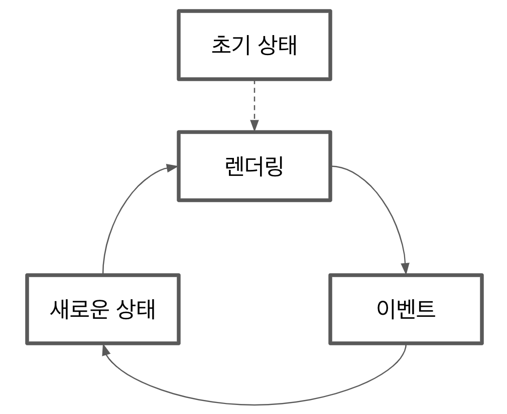

3장의 목적은 프레임워크 없이 애플리케이션에서 이벤트 관리하는 방법을 이해한다.
이벤트 핸들러가 무엇이며, 이를 DOM 요소에 올바르게 연결하는 방법이 나타나 있다.

## YAGNI 원칙

프로젝트에서 가장 중요한 기능에 초점을 맞춰 개발하고 새로운 요구가 생기면 이에 따라 아키텍처를 지속적으로 발전시켜 나간다.
이것이 YAGNI(You aren't gonna need it: 정말 필요하다고 간주할 떄까지 기능을 추가하지 마라)라고 하는 익스트림 프로그래밍 원칙 중 하나다.

## DOM 이벤트 API

- 이벤트는 웹 애플리케이션에서 발생하는 동작으로, 브라우저는 사용자에게 이를 알려줘 사용자는 어떤 방식으로든 반응할 수 있다.
- 마우스 이벤트, 키보드 이벤트, 뷰 이벤트를 포함한 사용자가 트리거한 이벤트에 반응할 수 있다.
- 시스템 자체에서도 이벤트를 생성할 수 있다. 예를 들어, 네트워크 상태의 변화나 DOM 콘텐츠가 로드될 때 발생하는 이벤트에 따라 사용자는 반응할 수 있다.
- 이벤트에 반응하려면 이벤트를 트리거한 DOM 요소에 연결해야 한다.

:::note
뷰나 시스템 이벤트의 경우 이벤트 핸들러를 window 객체에 연결해야 함
:::

### on\* 속성을 핸들러에 연결

이벤트 핸들러를 DOM 요소에 연결하는 방법은 빠르지만 지저분한 방법으로 on\* 속성을 사용할 수 있다.
모든 이벤트 타입마다 DOM 요소에 해당되는 속성을 가진다.
button에는 onclick, onmouseover, onblur, onfocus 등이 있다.

```js title="onclick 속성에 클릭 핸들러 연결"
const button = document.querySelector('button');
button.onclick = () => {
  console.log('Click managed using onclick property');
};
```

- 빠르지만 이 방법은 나쁜방법으로 간주된다.
- 가장 큰 이유는 속성을 사용하면 한번에 하나의 핸들러만 연결할 수 있기 때문이다. 따라서 코드가 onclick 핸들러를 덮어 쓰면 원래 핸들러는 영원히 손실된다.

### addEventListener로 핸들러 연결

이벤트를 처리하는 모든 DOM 노드에 EventTarget 인터페이스를 구현한다. 이 인터페이스의 addEventListener 메서드는 이벤트 핸들러를 DOM 노드에 추가한다.

```js title="addEventListener로 클릭 이벤트 핸들러 연결"
const button = document.querySelector('button');
button.addEventListener('click', () => {
  console.log('Clicked using addEventListener');
});
```

```js title="복수의 클릭 이벤트 핸들러"
const button = document.querySelector('button');
button.addEventListener('click', () => {
  console.log('First handler');
});
button.addEventListener('click', () => {
  console.log('Second handler');
});
```

DOM에 요소가 더 이상 존재하지 않으면 메모리 누수를 방지하고자 이벤트 리스너도 삭제해야 한다. 이를 위해 removeEventListener 메서드를 사용해야 한다.

```js title="이벤트 핸들러 삭제"
const button = document.querySelector('button');
const firstHandler = () => {
  console.log('First handler');
};
const secondHandler = () => {
  console.log('Second handler');
};

button.addEventListener('click', firstHandler);
button.addEventListener('click', secondHandler);

window.setTimeout(() => {
  button.removeEventListenr('click', firstHandler);
  button.removeEventListenr('click', secondHandler);
  console.log('Removed Event Handlers');
}, 1000);
```

이벤트 핸들러를 제거하려면 removeEventListener 메서드에 매개변수로 전달할 수 있도록 이에 대한 참조를 유지해야 한다는 것이다.

### 이벤트 객체

이벤트에는 포인터 좌표, 이벤트 타입, 이벤트를 트리거한 요소 같은 정보들이 포함되어 있다.

```js title="콘솔에 이벤트 객체 출력"
const button = document.querySelector('button');
button.addEventListener('click', (e) => {
  console.log('event', e);
});
```

- 웹 애플리케이션에 전달된 모든 이벤트에는 Event 인터페이스를 구현한다. 타입에 따라 이벤트 객체는 Event 인터페이스를 확장하는 좀 더 구체적인 Event 인터페이스를 구현할 수 있다.
- click 이벤트는 MouseEvent 인터페이스를 구현한다. 이 인터페이스에는 이벤트 중 포인터의 좌표나 이동에 대한 정보와 다른 유용한 데이터가 포함되어 있다.

### DOM 이벤트 라이프사이클

```js
button.addEventListener('click', handler, false);
```

세 번째 매개변수는 `useCapture`라고 불리며 기본값은 false다. 이 매개변수가 선택 사항이긴 하지만 이상적으로 폭넓은 브라우저 호환성을 얻으려면 포함시켜야 한다.

#### 이벤트 버블링

```html title="간단한 중첩 HTML 구조"
<body>
  <div>
    This is a container
    <button>Click Here</button>
  </div>
</body>
```

```js title="버블 단계 매커니즘"
const button = document.querySelector('button');
const div = document.querySelector('div');

div.addEventListener(
  'click',
  (e) => {
    console.log('Div Clicked');
  },
  false
);

button.addEventListener(
  'click',
  (e) => {
    console.log('Button Clicked');
  },
  false
);
```

- 이벤트 핸들러는 div, button의 DOM 요소에 모두 연결돼 있다.
- 버튼을 클릭하면 button이 div 안에 있으므로 button 부터 시작해 두 핸들러가 모두 호출된다.
- 이벤트 객체는 이를 트리거한 DOM 노드(button)에서 시작해, 모든 조상 노드로 올라간다.
- 이것을 **이벤트 버블링**이라고 한다.
- 핸들러가 `상향식`으로 처리된다.

```js title="버블 체인 중지"
const button = document.querySelector('button');
const div = document.querySelector('div');

div.addEventListener(
  'click',
  () => {
    console.log('Div Clicked');
  },
  false
);

button.addEventListener(
  'click',
  (e) => {
    // highlight-next-line
    e.stopPropagation();
    console.log('Button Clicked');
  },
  false
);
```

- div 핸들러가 호출되지 않는다.
- 복잡한 레이아웃에서 유용할 수 있다.
- 핸들러의 순서에 의존하는 경우 코드를 유지하기 어려워진다.
- 이럴 때 **이벤트 위임 패턴**을 쓴다.

```js title="useCapture를 이용해 이벤트 핸들러 순서 바꾸기"
const button = document.querySelector('button');
const div = document.querySelector('div');

div.addEventListener(
  'click',
  (e) => {
    console.log('Div Clicked');
  },
  // highlight-next-line
  true
);

button.addEventListener(
  'click',
  (e) => {
    console.log('Button Clicked');
  },
  // highlight-next-line
  true
);
```

- 핸들러의 실행 순서를 반대로 할 수 있다.
- div 핸들러는 button 핸들러보다 먼저 호출된다.
- 버블단계 대신 `캡쳐단계`에서 이벤트 핸들러가 추가된다.
- 핸들러가 `하향식`으로 처리된다.

#### DOM 이벤트 라이프 사이클

시스템은 `<html>`태그에서 핸들러 관리를 시작하고 이벤트를 트리거한 요소를 만날 때까지 내려간다. 생성된 모든 DOM 이벤트에 대해 브라우저는 캡처 단계를 실행한 다음, 버블 단계를 실행한다.

- 캡처 단계 Capture Phase: 이벤트가 html에서 Target Element 로 이동한다.
- 목표 단계 Target Phase: 이벤트가 Target Element에 도달한다.
- 버블 단계 Bubbling Phase: 이벤트가 Target Element에서 html로 이동한다.

### 사용자 정의 이벤트 사용

[customEvent](https://developer.mozilla.org/ko/docs/Web/API/CustomEvent/CustomEvent) 생성자 함수를 사용한다.

:::note
CustomEvent(typeArg, options);
<small>CustomEvent() 생성자는 새로운 CustomEvent를 생성합니다.</small>

- typeArg
  이벤트의 이름을 나타내는 문자열입니다.

- options
  다음 속성을 포함하는 객체입니다.

  - "detail": 이 이벤트 내에 포함할, 이벤트의 세부 정보를 나타내는 값입니다. 기본 값은 null입니다. 처리기에서 CustomEvent.detail 속성을 통해 이 값에 접근할 수 있습니다.
  - Event() 생성자의 옵션에 지정할 수 있는 모든 속성.

```js
const catFound = new CustomEvent('animalfound', {
  detail: {
    name: 'cat',
  },
});
```

:::

<iframe src="https://codesandbox.io/embed/reverent-drake-ji2bbj?fontsize=14&hidenavigation=1&theme=dark"
  width='100%'
  height='400px'></iframe>

```js title="index.js"
const EVENT_NAME = 'FiveCharInputValue';
const input = document.querySelector('input');

input.addEventListener('input', () => {
  const { length } = input.value;
  console.log('input length', length);
  if (length === 5) {
    const time = new Date().getTime();
    // highlight-start
    const event = new CustomEvent(EVENT_NAME, {
      detail: {
        time,
      },
    });

    input.dispatchEvent(event);
    // highlight-end
  }
});

input.addEventListener(EVENT_NAME, (e) => {
  console.log('handling custom event...', e.detail);
});
```

:::note
'input' 이벤트는 `<input>`, `<select>`, `<textarea>`가 변경되면 트리거 된다.
:::

:::note
EventTarget.dispatchEvent()

이벤트 객체를 생성한 다음엔 EventTarget.dispatchEvent(event)를 호출해 요소에 있는 이벤트를 반드시 '실행’시켜줘야 합니다.
이렇게 이벤트를 실행시켜줘야 핸들러가 일반 브라우저 이벤트처럼 이벤트에 반응할 수 있습니다.
bubbles 플래그를 true로 해서 이벤트를 만든 경우 이벤트는 제대로 버블링 됩니다.

:::

- input 값의 길이가 5라면 개발자가 정의한 `FiveCharInputValue` 이벤트를 발생시킨다.

## TodoMVC에 이벤트 추가

- 항목 삭제
- 항목의 완료 여부 토글
- 필터 변경
- 항목 생성
- 완성된 모든 항목 삭제
- 모든 항목의 완료 여부 토글
- 항목 편집

### 문제가 있는 렌더링 엔진

```js title="/view/todos.js"
const getTodoElement = (todo) => {
  const { text, completed } = todo;

  return `
      <li ${completed ? 'class="completed"' : ''}>
        <div class="view">
          <input 
            ${completed ? 'checked' : ''}
            class="toggle" 
            type="checkbox">
          <label>${text}</label>
          <button class="destroy"></button>
        </div>
        <input class="edit" value="${text}">
      </li>`;
};

export default (targetElement, { todos }) => {
  const newTodoList = targetElement.cloneNode(true);
  const todosElements = todos.map(getTodoElement).join('');
  newTodoList.innerHTML = todosElements;
  return newTodoList;
};
```

- DOM 요소 대신 문자열로 동작 중이다.
- 리스트의 모든 todo 요소는 문자열로 생성되고 하나로 합쳐진 뒤, `innerHTML`으로 부모 리스트에 추가된다.
- 문자열에는 이벤트 핸들러를 추가할 수 없다.
- **addEventListner를 호출하려면 DOM 노드가 필요하다.**

### 템플릿 요소

addEventListner를 호출하려면 DOM 노드가 필요하므로, DOM 노드를 생성하는 기술을 쓰면 되겠다.  
`document.createElement`로 새로운 DOM 노드를 생성할 수 있지만 코드를 읽고 유지하기 어렵다.

#### template 태그

template 태그 안에 todo 요소의 마크업을 유지해보자.  
template 태그는 렌더링 엔진의 '스탬프'로 사용할 수 있는 보이지 않는 태그다.

1. 결과

<iframe src="https://codesandbox.io/embed/inspiring-snyder-llk2tk?fontsize=14&hidenavigation=1&theme=dark"
  width='100%'
  height='400px'></iframe>

2. 템플릿 todo.js

```js title="/view/todos.js"
// highlight-start
let template;

const createNewTodoNode = () => {
  if (!template) {
    template = document.getElementById('todo-item');
  }

  return template.content.firstElementChild.cloneNode(true);
};
// highlight-end

const getTodoElement = (todo) => {
  const { text, completed } = todo;

  // highlight-start
  const element = createNewTodoNode();

  element.querySelector('input.edit').value = text;
  element.querySelector('label').textContent = text;

  if (completed) {
    element.classList.add('completed');
    element.querySelector('input.toggle').checked = true;
  }

  return element;
  // highlight-end
};

export default (targetElement, { todos }) => {
  const newTodoList = targetElement.cloneNode(true);

  // highlight-start
  newTodoList.innerHTML = '';

  todos.map(getTodoElement).forEach((element) => {
    // id="todo-item"인 templete을 반복문으로 돌림
    newTodoList.appendChild(element);
  });
  // highlight-end

  return newTodoList;
};
```

- 이제 이 템플릿으로 모든 앱으로 확장하자.

```html title="index.html"
<body>
  <template id="todo-item">
    <!-- todo 항목 내용을 여기에 놓는다 -->
  </template>
  <template id="todo-app">
    <section class="todoapp">
      <!-- 앱 내용을 여기에 놓는다 -->
    </section>
  </template>
  <div id="root">
    <div data-component="app"></div>
  </div>
</body>
```

3. 콘텐츠 생성하기

- 템플릿을 활용해 콘텐츠를 생성해보자.
- app.js에서 만들어진다.

```js title="view/app.js"
let template;

const createAppElement = () => {
  if (!template) {
    template = document.getElementById('todo-app');
  }

  return template.content.firstElementChild.cloneNode(true);
};

export default (targetElement) => {
  const newApp = targetElement.cloneNode(true);
  newApp.innerHTML = '';
  newApp.appendChild(createAppElement());
  return newApp;
};
```

#### 기본 이벤트 처리 아키텍처

DOM 요소로 동작하는 새로운 렌더링 엔진을 작성했으니 이벤트 핸들러를 애플리케이션에 연결해보자.

새로운 상태마다 새로운 DOM 트리를 생성해 가상 DOM 알고리즘을 적용할 수 있다. 이 시나리오에서는 루프에 이벤트 핸들러를 쉽게 삽입할 수 있다.

- 모든 이벤트 다음에,
- 상태를 조작한 후,
- 새로운 상태로 메인 렌더링 함수를 호출한다.



1. 유스케이스의 단계

   1. 초기

      - 초기 상태: 비어있는 todo 리스트
      - 렌더링: 사용자에게 비어있는 리스트를 표시

   2. 추가 (event)

      - 이벤트: 사용자가 '더미 항목'이라는 새 항목을 생성
      - 새로운 상태: 하나의 항목을 가진 todo 리스트
      - 렌더링: 사용자에게 하나의 항목을 가진 리스트 표시

   3. 삭제 (event)

      - 이벤트: 사용자가 항목을 삭제
      - 새로운 상태: 비어있는 todo 리스트
      - 렌더링: 사용자에게 비어있는 리스트를 표시

2. 결과

<iframe src="https://codesandbox.io/embed/tender-nash-yhb8hq?fontsize=14&hidenavigation=1&theme=dark"
  width='100%'
  height='400px'></iframe>

3. registry의 세 번째 매개변수

```js title="registry.js"
const registry = {};

const renderWrapper = (component) => {
  return (targetElement, state, events) => {
    // highlight-next-line
    const element = component(targetElement, state, events);

    const childComponents = element.querySelectorAll('[data-component]');

    Array.from(childComponents).forEach((target) => {
      const name = target.dataset.component;

      const child = registry[name];
      if (!child) {
        return;
      }

      // highlight-next-line
      target.replaceWith(child(target, state, events));
    });

    return element;
  };
};

const add = (name, component) => {
  registry[name] = renderWrapper(component);
};

// highlight-next-line
const renderRoot = (root, state, events) => {
  const cloneComponent = (root) => {
    return root.cloneNode(true);
  };

  // highlight-next-line
  return renderWrapper(cloneComponent)(root, state, events);
};

export default {
  add,
  renderRoot,
};
```

4. 컨트롤러 index.js의 변화

```js title="index.js"
import todosView from './view/todos.js';
import counterView from './view/counter.js';
import filtersView from './view/filters.js';
import appView from './view/app.js';
import applyDiff from './applyDiff.js';

import registry from './registry.js';

registry.add('app', appView);
registry.add('todos', todosView);
registry.add('counter', counterView);
registry.add('filters', filtersView);

const state = {
  todos: [],
  currentFilter: 'All',
};

// highlight-start
const events = {
  addItem: (text) => {
    state.todos.push({
      text,
      completed: false,
    });
    render();
  },
  updateItem: (index, text) => {
    state.todos[index].text = text;
    render();
  },
  deleteItem: (index) => {
    state.todos.splice(index, 1);
    render();
  },
  toggleItemCompleted: (index) => {
    const { completed } = state.todos[index];
    state.todos[index].completed = !completed;
    render();
  },
  completeAll: () => {
    state.todos.forEach((t) => {
      t.completed = true;
    });
    render();
  },
  clearCompleted: () => {
    state.todos = state.todos.filter((t) => !t.completed);
    render();
  },
  changeFilter: (filter) => {
    state.currentFilter = filter;
    render();
  },
};
// highlight-end

const render = () => {
  window.requestAnimationFrame(() => {
    // highlight-next-line
    const main = document.querySelector('#root');

    // highlight-next-line
    const newMain = registry.renderRoot(main, state, events);

    applyDiff(document.body, main, newMain);
  });
};

render();
```

5. app.js에서 addEvent 함수 구현

```js title="view/app.js"
let template;

const getTemplate = () => {
  if (!template) {
    template = document.getElementById('todo-app');
  }

  return template.content.firstElementChild.cloneNode(true);
};

// highlight-start
const allTodosCompleted = (todos) => {
  if (todos.length === 0) {
    return false;
  }
  return !todos.find((t) => !t.completed);
};

const noCompletedItemIsPresent = (todos) => !todos.find((t) => t.completed);

const addEvents = (targetElement, events) => {
  const { clearCompleted, completeAll, addItem } = events;

  targetElement.querySelector('.new-todo').addEventListener('keypress', (e) => {
    if (e.key === 'Enter') {
      addItem(e.target.value);
      e.target.value = '';
    }
  });

  targetElement
    .querySelector('input.toggle-all')
    .addEventListener('click', completeAll);

  targetElement
    .querySelector('.clear-completed')
    .addEventListener('click', clearCompleted);
};
// highlight-end

export default (targetElement, state, events) => {
  const newApp = targetElement.cloneNode(true);

  newApp.innerHTML = '';
  newApp.appendChild(getTemplate());

  if (noCompletedItemIsPresent(state.todos)) {
    newApp.querySelector('.clear-completed').classList.add('hidden');
  } else {
    newApp.querySelector('.clear-completed').classList.remove('hidden');
  }

  newApp.querySelector('input.toggle-all').checked = allTodosCompleted(
    state.todos
  );

  addEvents(newApp, events);

  return newApp;
};
```

5. todos.js에서 delete, filter, attach 함수 구현

```js title="view/todos.js"
let template;

const createNewTodoNode = () => {
  if (!template) {
    template = document.getElementById('todo-item');
  }

  return template.content.firstElementChild.cloneNode(true);
};

// highlight-start
const attachEventsToTodoElement = (element, index, events) => {
  const handler = (e) => events.deleteItem(index);

  element.querySelector('button.destroy').addEventListener('click', handler);

  element
    .querySelector('input.toggle')
    .addEventListener('click', (e) => events.toggleItemCompleted(index));

  element.addEventListener('dblclick', () => {
    element.classList.add('editing');
    element.querySelector('input.edit').focus();
  });

  element.querySelector('input.edit').addEventListener('keypress', (e) => {
    if (e.key === 'Enter') {
      element.classList.remove('editing');
      events.updateItem(index, e.target.value);
    }
  });
};
// highlight-end

const getTodoElement = (todo, index, events) => {
  const { text, completed } = todo;

  const element = createNewTodoNode();

  element.querySelector('input.edit').value = text;
  element.querySelector('label').textContent = text;

  if (completed) {
    element.classList.add('completed');
    element.querySelector('input.toggle').checked = true;
  }

  attachEventsToTodoElement(element, index, events);

  return element;
};

// highlight-start
const filterTodos = (todos, filter) => {
  const isCompleted = (todo) => todo.completed;
  if (filter === 'Active') {
    return todos.filter((t) => !isCompleted(t));
  }

  if (filter === 'Completed') {
    return todos.filter(isCompleted);
  }

  return [...todos];
};
// highlight-end

export default (targetElement, state, events) => {
  const { todos, currentFilter } = state;
  const newTodoList = targetElement.cloneNode(true);

  newTodoList.innerHTML = '';

  // highlight-next-line
  const filteredTodos = filterTodos(todos, currentFilter);

  filteredTodos
    .map((todo, index) => getTodoElement(todo, index, events))
    .forEach((element) => {
      newTodoList.appendChild(element);
    });

  return newTodoList;
};
```

### 이벤트 위임

- 이벤트를 조금 붙인 것 뿐인데 코드가 너무 늘어지고 정신이 없어졌다.
- 이벤트 위임으로 리스트 자체에 하나의 이벤트 핸들러만 연결하여 작은 요소가 별도의 이벤트 핸들러를 갖지 않게 해보자

```js
let template;

const createNewTodoNode = () => {
  if (!template) {
    template = document.getElementById('todo-item');
  }

  return template.content.firstElementChild.cloneNode(true);
};

const getTodoElement = (todo, index) => {
  const { text, completed } = todo;

  const element = createNewTodoNode();

  element.querySelector('input.edit').value = text;
  element.querySelector('label').textContent = text;

  if (completed) {
    element.classList.add('completed');
    element.querySelector('input.toggle').checked = true;
  }

  // highlight-next-line
  element.querySelector('button.destroy').dataset.index = index;

  return element;
};

export default (targetElement, state, events) => {
  const { todos } = state;
  const { deleteItem } = events;
  const newTodoList = targetElement.cloneNode(true);

  newTodoList.innerHTML = '';

  todos
    .map((todo, index) => getTodoElement(todo, index))
    .forEach((element) => {
      newTodoList.appendChild(element);
    });

  newTodoList.addEventListener('click', (e) => {
    // highlight-start
    if (e.target.matches('button.destroy')) {
      deleteItem(e.target.dataset.index);
    }
    // highlight-end
  });

  return newTodoList;
};
```

:::note
Element.matches()

요소가 '실제' 이벤트 대상인지 확인하는데 쓰인다.

:::

## 독후감

바닐라 자바스크립트로 한땀한땀 요소를 가져와 이벤트를 붙이던 옛 생각이 새록새록 났다.  
이벤트를 본격적으로 붙이기 시작하면서 따라가느라 힘들었지만 어찌저찌 이해는 한 것 같다.  
저자도 addItem까지 쓰다가 집필에 지쳐서 github에 따로 올린 것 같다는 생각이 들어서 조금 아쉬웠다... 차라리 이쪽 부분을 좀 자세히 설명해주었으면 좋았겠다 싶었다.

한 가지 의문인 것은 todo를 추가하는 것은 app.js에서 하고, 지우거나 수정하는 것은 왜 todo.js에서 하는 건지 이해할 수 없었다.
여러모로 리팩토링이 필요한 것 같으나 이벤트를 어떻게 붙이는지만 이해하였다.

## Reference

- [모던 자바스크립트](https://ko.javascript.info/dispatch-events#ref-1052)
- [customEvent](https://developer.mozilla.org/ko/docs/Web/API/CustomEvent/CustomEvent)
- [template](https://developer.mozilla.org/en-US/docs/Web/HTML/Element/template)
