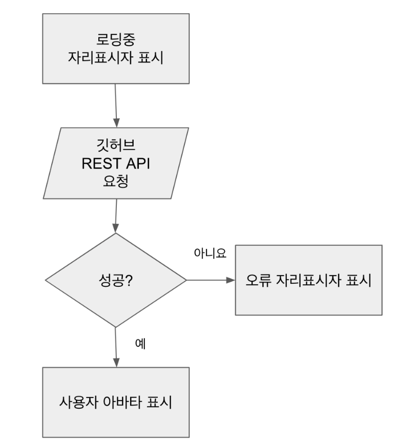

4장의 목적은 DOM 요소를 렌더링하고 시스템이나 사용자의 이벤트에 반응하는 방법에 대해 알아본다.

## API

웹 구성 요소는 세 가지 기술로 구성된다.

- HTML 템플릿 : `<template>` 태그는 콘텐츠가 렌더링 되지는 않지만 자바스크립트 코드에서 동적인 콘텐츠를 생성하는데 '스탬프'로 사용되도록 하려는 경우에 유용하다.
- [사용자 정의 요소(Custom Elements)](https://developer.mozilla.org/en-US/docs/Web/Web_Components/Using_custom_elements) : 이 API를 통해 개발자는 완전한 기능을 갖춘 자신만의 DOM 요소를 작성할 수 있다.
- [섀도우(Shadow) DOM](https://developer.mozilla.org/en-US/docs/Web/Web_Components/Using_shadow_DOM) : 이 기술은 웹 구성요소(Web Component)가 구성요소(Component) 외부의 DOM에 영향을 받지 않아야 하는 경우에 유용하다.
  다른 사람들과 공유할 수 있도록 Component 라이브러리나 위젯을 작성하려는 경우 매우 유용하다.

:::caution
섀도우 돔과 가상 돔은 다르다. 섀도우 돔은 캡슐화와 관련되어 있으며, 가상 돔은 성능과 관련되어 있다.
[참조링크](https://develoger.com/shadow-dom-virtual-dom-889bf78ce701)
:::

### Custom Elements API(사용자 정의 요소)

- [mdn](https://developer.mozilla.org/en-US/docs/Web/Web_Components/Using_custom_elements)

Web Component 태그를 작성할때는 `-(hypen)`을 붙여주어야 한다. 두 단어 이상의 태그를 사용하여 커스텀 HTML을 만든다.

```html title="Custom HTML tag"
<hello-world />
```

### 속성(attributes) 관리

Web Component의 가장 중요한 기능은 개발자가 어떤 프레임워크와도 호환되는 새로운 Component를 만들 수 있다는 것이다. 이 목적을 달성하려면 Component에 다른 표준 HTML 요소와 동일 공용 API가 있어야 한다.

#### input의 value 속성 변경

```html title=" HTML마크에 직접 추가"
<input text="text" value="Frameworkless" />
```

```js title="세터(setter) 사용"
input.value = 'Frameworkless';
```

```js title="setAttributes 메서드 사용"
input.setAttribute('value', 'Frameworkless');
```

#### 종합 예제

<iframe src="https://codesandbox.io/embed/vigorous-jang-y1xgjf?fontsize=14&hidenavigation=1&theme=dark"
  width='100%'
  height='400px'
   ></iframe>

- `connectedCallback`: Custom Element의 라이프 사이클 메서드 중 하나다. 이 메서드는 Component가 DOM에 연결될 때 호출 된다. 리액트의 `componentDidMount` 메서드와 매우 유사하다. 예제처럼 Component의 콘텐츠를 렌더링하거나 타이머를 시작하거나 또는 네트워크에서 데이터를 가져오기에 좋은 장소이다.
- `disconnectedCallback`: Component가 DOM에서 삭제될 때 호출 되며, 정리 작업에 유용한 메서드다.
- 클래스로 새로 생성한 Custom Element를 사용하려면 브라우저 Component 레지스트리에 추가해야 된다. 이때, `window.customElements` 속성의 `define` 메서드를 사용한다.
- 문자열이 아닌 속성이 필요한 경우, 속성을 변환해야 한다.

### attributeChangedCallback

초기 렌더링 이후 클린 이벤트 핸들러로 속성을 변경 할 경우에는 화면에 반영되지 않는다.

<iframe src="https://codesandbox.io/embed/zen-leftpad-1qg7x0?fontsize=14&hidenavigation=1&theme=dark"
  width='100%'
  height='400px'
   ></iframe>

이때에는 속성이 변경될 때마다 호출되게 하는 메서드를 사용한다.
새로운 color 속성이 제공될 때마다 DOM이 업데이트 되도록 helloworld 구성요소의 코드를 수정한다.

<iframe src="https://codesandbox.io/embed/charming-pine-duc8n7?fontsize=14&hidenavigation=1&theme=dark"
  width='100%'
  height='400px'
   ></iframe>

```js title="HelloWorld.js"
const DEFAULT_COLOR = 'black';

export default class HelloWorld extends HTMLElement {
  // highlight-next-line
  static get observedAttributes() {
    return ['color'];
  }

  get color() {
    return this.getAttribute('color') || DEFAULT_COLOR;
  }

  set color(value) {
    this.setAttribute('color', value);
  }
  // highlight-next-line
  attributeChangedCallback(name, oldValue, newValue) {
    if (!this.div) {
      return;
    }

    if (name === 'color') {
      this.div.style.color = newValue;
    }
  }

  connectedCallback() {
    window.requestAnimationFrame(() => {
      this.div = document.createElement('div');
      this.div.textContent = 'Hello World!';
      this.div.style.color = this.color;
      this.appendChild(this.div);
    });
  }
}
```

- 이때 observedAttributes 배열에 나열된 속성만 attributeChangedCallback가 트리거한다.

### 가상 DOM 통합

아래 코드는 많은 속성을 가진 경우에 유용하다.

<iframe src="https://codesandbox.io/embed/agitated-paper-13g78t?fontsize=14&hidenavigation=1&theme=dark"
  width='100%'
  height='400px'
   ></iframe>

```js title="HelloWorld.js"
import applyDiff from './applyDiff.js';

const DEFAULT_COLOR = 'black';

const createDomElement = (color) => {
  const div = document.createElement('div');
  div.textContent = 'Hello World!';
  div.style.color = color;
  return div;
};

export default class HelloWorld extends HTMLElement {
  static get observedAttributes() {
    return ['color'];
  }

  get color() {
    return this.getAttribute('color') || DEFAULT_COLOR;
  }

  set color(value) {
    this.setAttribute('color', value);
  }

  attributeChangedCallback(name, oldValue, newValue) {
    // highlight-next-line
    if (!this.hasChildNodes()) {
      return;
    }

    // highlight-next-line
    applyDiff(this, this.firstElementChild, createDomElement(newValue));
  }

  connectedCallback() {
    window.requestAnimationFrame(() => {
      this.appendChild(createDomElement(this.color));
    });
  }
}
```

### 사용자 정의 이벤트(Custom Event)

#### github avatar 예제



1. 구성요소가 DOM에 연결되면 `loading`이라는 자리표시자가 표시된다.
2. 깃허브 REST API로 아바타 이미지 URL을 가져온다.
3. 성공하면 아바타가 표시, 실패하면 오류 자리표시자가 표시된다.

<iframe src="https://codesandbox.io/embed/blissful-sutherland-ch5lqy?fontsize=14&hidenavigation=1&theme=dark"
  width='100%'
  height='400px'
   ></iframe>

```js title="GitHubAvatar.js"
const ERROR_IMAGE = 'https://files-82ee7vgzc.now.sh';
const LOADING_IMAGE = 'https://files-8bga2nnt0.now.sh';

const getGitHubAvatarUrl = async (user) => {
  if (!user) {
    return;
  }

  const url = `https://api.github.com/users/${user}`;

  const response = await fetch(url);
  if (!response.ok) {
    throw new Error(response.statusText);
  }
  const data = await response.json();
  return data.avatar_url;
};

// custom-html
export default class GitHubAvatar extends HTMLElement {
  constructor() {
    super();
    // highlight-next-line
    this.url = LOADING_IMAGE;
  }

  // user 속성 정의.
  get user() {
    return this.getAttribute('user');
  }

  set user(value) {
    this.setAttribute('user', value);
  }

  render() {
    window.requestAnimationFrame(() => {
      this.innerHTML = '';
      const img = document.createElement('img');
      img.src = this.url;
      this.appendChild(img);
    });
  }

  async loadNewAvatar() {
    const { user } = this;
    if (!user) {
      return;
    }
    try {
      // highlight-next-line
      this.url = await getGitHubAvatarUrl(user);
    } catch (e) {
      // highlight-next-line
      this.url = ERROR_IMAGE;
    }

    this.render();
  }

  connectedCallback() {
    this.render();
    this.loadNewAvatar();
  }
}
```

#### github avatar 사용자 정의 이벤트

<iframe src="https://codesandbox.io/embed/amazing-shockley-59186o?fontsize=14&hidenavigation=1&theme=dark"
  width='100%'
  height='400px'
   ></iframe>

```js title="index.js"
import GitHubAvatar, { EVENTS } from './components/GitHubAvatar.js';

window.customElements.define('github-avatar', GitHubAvatar);

document.querySelectorAll('github-avatar').forEach((avatar) => {
  avatar.addEventListener(EVENTS.AVATAR_LOAD_COMPLETE, (e) => {
    console.log('Avatar Loaded', e.detail.avatar);
  });

  avatar.addEventListener(EVENTS.AVATAR_LOAD_ERROR, (e) => {
    console.log('Avatar Loading error', e.detail.error);
  });
});
```

```js title="GitHubAvatar.js"
const ERROR_IMAGE = 'https://files-82ee7vgzc.now.sh';
const LOADING_IMAGE = 'https://files-8bga2nnt0.now.sh';
const AVATAR_LOAD_COMPLETE = 'AVATAR_LOAD_COMPLETE';
const AVATAR_LOAD_ERROR = 'AVATAR_LOAD_ERROR';

// highlight-start
export const EVENTS = {
  AVATAR_LOAD_COMPLETE,
  AVATAR_LOAD_ERROR,
};
// highlight-end

const getGitHubAvatarUrl = async (user) => {
  if (!user) {
    return;
  }

  const url = `https://api.github.com/users/${user}`;

  const response = await fetch(url);
  if (!response.ok) {
    throw new Error(response.statusText);
  }
  const data = await response.json();
  return data.avatar_url;
};

export default class GitHubAvatar extends HTMLElement {
  constructor() {
    super();
    this.url = LOADING_IMAGE;
  }

  get user() {
    return this.getAttribute('user');
  }

  set user(value) {
    this.setAttribute('user', value);
  }

  render() {
    window.requestAnimationFrame(() => {
      this.innerHTML = '';
      const img = document.createElement('img');
      img.src = this.url;
      this.appendChild(img);
    });
  }

  // 사용자 이벤트 정의
  // highlight-start
  onLoadAvatarComplete() {
    const event = new CustomEvent(AVATAR_LOAD_COMPLETE, {
      detail: {
        avatar: this.url,
      },
    });

    this.dispatchEvent(event);
  }

  onLoadAvatarError(error) {
    const event = new CustomEvent(AVATAR_LOAD_ERROR, {
      detail: {
        error,
      },
    });

    this.dispatchEvent(event);
  }
  // highlight-end

  async loadNewAvatar() {
    const { user } = this;
    if (!user) {
      return;
    }
    try {
      this.url = await getGitHubAvatarUrl(user);
      this.onLoadAvatarComplete();
    } catch (e) {
      this.url = ERROR_IMAGE;
      this.onLoadAvatarError(e);
    }

    this.render();
  }

  connectedCallback() {
    this.render();
    this.loadNewAvatar();
  }
}
```
