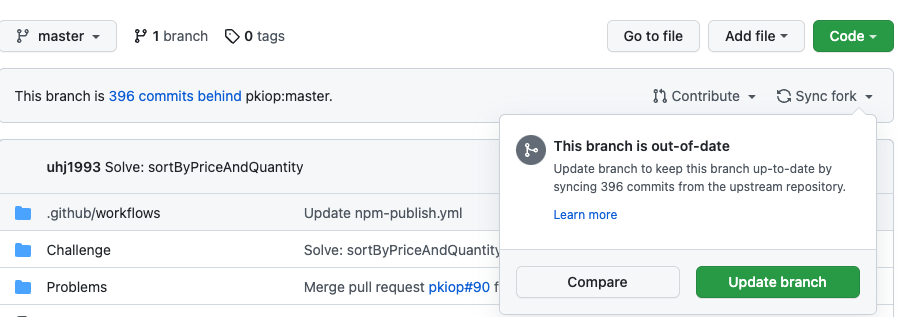

## 언제 쓰이나요?

1. 원본 Repo를 fork해서 본인의 Repo에서 개발
2. 팀원도 같은 방식으로 개발
3. 팀원의 커밋이 PR 또는 MR 되어 원본 Repo가 업데이트 됨.
4. 이때 원본 Repo와 본인의 Repo를 동기화하고 싶을 때.

## 사용법

> upstream과 downstream은 상대적인 개념이라 origin과 local을 기준으로 생각하면 origin이 upstream, local이 downstream이 됩니다.
> 그 이유는 push와 pull을 기준으로 생각했을 때 origin으로부터 local로 흐르는 관계가 형성되기 때문입니다.

### 웹 UI 분기 동기화

1. github에서는 웹 UI에서 분기 동기화를 수행할 수 있다.

   1. GitHub는 원본 레포지토리가 변경되면 자동으로 포크 동기화 UI를 띄워준다. **분기된 레포지토리(local, fork 레포지토리)의 기본 페이지로 이동**.
   2. `Sync fork` 드롭다운을 선택.
   3. 업스트림 리포지토리에서 커밋에 대한 세부 정보를 검토한 다음 `Update branch`를 클릭.
      
   4. 업스트림 리포지토리의 변경 사항이 충돌을 일으키는 경우 GitHub는 충돌을 해결하기 위해 끌어오기 요청을 생성하라는 메시지를 표시.

### 터미널 분기 동기화

1. gitlab에는 웹 UI 분기 동기화 기능이 없는 것 같아서 별수없이 터미널에서 동기화해주어야 한다. 물론, github에서도 터미널로 동기화할 수 있다.
   1. 먼저 Git의 upstream 레포지토리(원본 레포지토리)를 가리키는 원격을 구성한다.
      - 터미널을 연다 (ctrl + shift + `)
      - `git remote -v` 명령으로 _현재_ 구성된 원격 저장소를 확인. 이 작업은 단순히 '확인'일 뿐이니 헷깔리지 말자.
      ```bash
        $ git remote -v
        origin  https://github.com/YOUR_USERNAME/YOUR_FORK.git (fetch)
        origin  https://github.com/YOUR_USERNAME/YOUR_FORK.git (push)
      ```
      - 여기에 동기화해오고 싶은 **원본 repository** 를 upstream 이라는 이름으로 **추가**한다.
      ```bash
        git remote add upstream https://github.com/ORIGINAL_OWNER/ORIGINAL_REPOSITORY.git
      ```
      - `git remote -v`로 upstream repository 가 제대로 추가 되었는지 재확인한다.
      ```bash
      $ git remote -v
        origin    https://github.com/YOUR_USERNAME/YOUR_FORK.git (fetch)
        origin    https://github.com/YOUR_USERNAME/YOUR_FORK.git (push)
        upstream  https://github.com/ORIGINAL_OWNER/ORIGINAL_REPOSITORY.git (fetch)
        upstream  https://github.com/ORIGINAL_OWNER/ORIGINAL_REPOSITORY.git (push)
      ```
   2. `git fetch upstream` 명령어로 업데이트 되어있는 upstream repository(원본 저장소)에서 분기 및 해당 커밋을 가져온다.
      ```bash
      $ git fetch upstream
          remote: Counting objects: 75, done.
          remote: Compressing objects: 100% (53/53), done.
          remote: Total 62 (delta 27), reused 44 (delta 9)
          Unpacking objects: 100% (62/62), done.
          From https://github.com/ORIGINAL_OWNER/ORIGINAL_REPOSITORY
          * [new branch]      master     -> upstream/master
      ```
   3. 원본 레포지토리를 당겨올 **포크의 브랜치**를 확인한다. develop으로 pull을 받고 싶다면 develop에, main에 받고 싶다면 main 브랜치에 위치해있어야 한다. 다음 예시 코드는 main branch에 맞추었다.
      ```bash
      $ git checkout main
      > Switched to branch 'main'
      ```
   4. 원본 레포지토리의 변경 사항을 fork한 브랜치로 merge 한다. 이때에도 원본 레포지토리의 브랜치를 골라서 merge 할 수 있다. develop에 있는 코드를 받아보고 싶다면 upstream/develop, main에 있는 코드를 받아보고 싶다면 upstream/main으로 받자. 다음 예시 코드는 upstream/main을 가져온다.
      ```bash
      $ git merge upstream/main
      > Updating a422352..5fdff0f
      > Fast-forward
      >  README                    |    9 -------
      >  README.md                 |    7 ++++++
      >  2 files changed, 7 insertions(+), 9 deletions(-)
      >  delete mode 100644 README
      >  create mode 100644 README.md
      ```
   5. 이 과정에서 충돌이 일어났다면 해결한다.
   6. `git push origin 브랜치명` 으로 자신의 fork repo에 push 한다.

## Reference

- [syncing-a-fork](https://docs.github.com/en/pull-requests/collaborating-with-pull-requests/working-with-forks/syncing-a-fork)
- [GitHub에서 협업을 위한 remote repository와 upstream 이해하기](https://pers0n4.io/github-remote-repository-and-upstream/)
