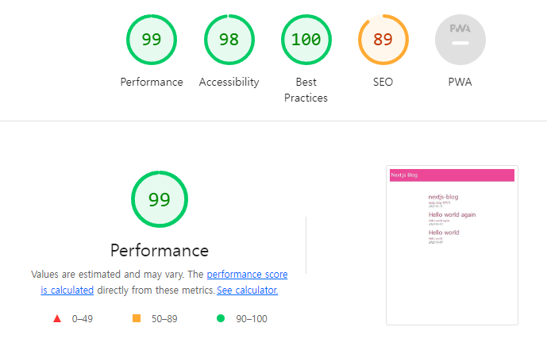
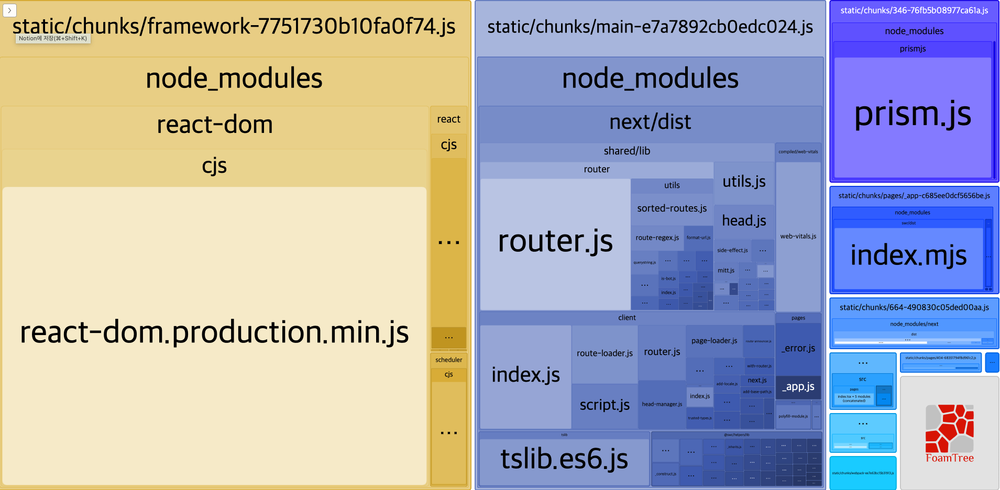
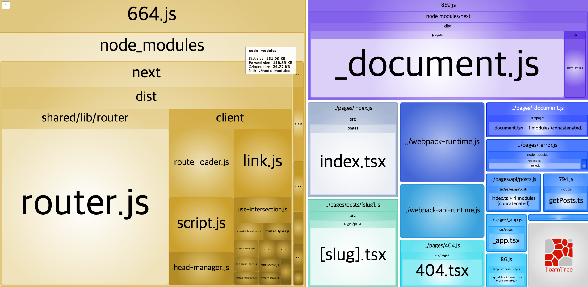
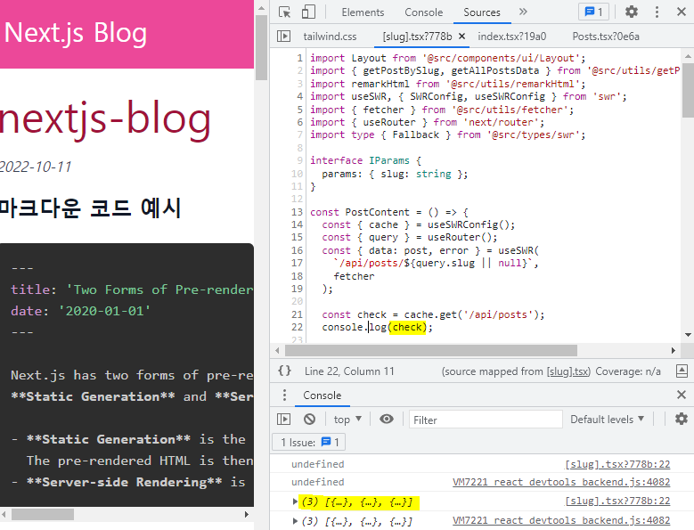
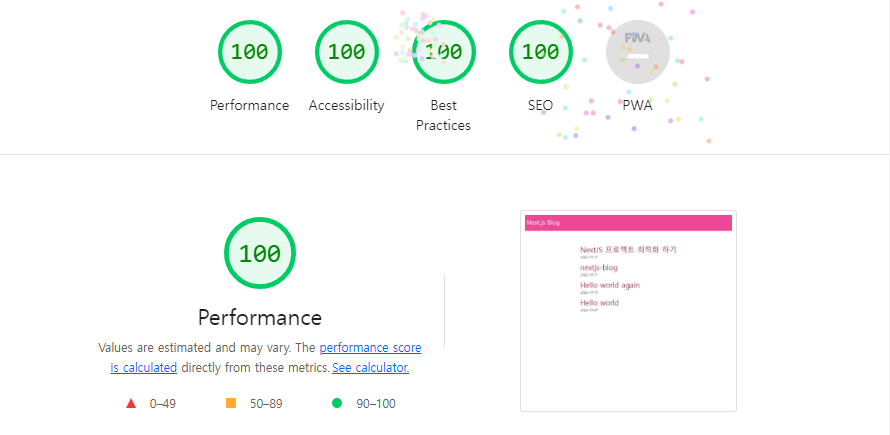

NextJS가 제공하는 기능과 lighthouse를 기반으로 웹사이트를 최적화 해보는 시간을 가졌습니다.

<!--truncate-->

## 최적화 하려는 프로젝트

[nextjs-blog](https://github.com/uhgenie7/nextjs-blog-challenge)

## 최적화 전, lighthouse 결과



- SSG로 만들어져있는데다 기능이 많이 없어서 대부분의 성능이 이미 높은 상태였다.
- 그러나 SSG로 만들어졌음에도 SEO의 점수가 낮기 때문에 SEO를 더 챙겨보기로 했다.

### 1. SEO

- `Head`를 사용하는 방법은 두 가지이다. `next/head` 에서 가져오는 방법과 `next/document`에서 가져오는 방법이 있다.
- 모든 페이지에서 meta 태그를 '공틍'으로 쓰고자 한다면 `pages/_document.tsx`에서 작업한다.
- 페이지마다 다른 meta 태그를 부여하고자 한다면 (ex: title) `next/head` 에서 가져와서 쓴다.
- 해당 프로젝트는 공통으로 쓰고자 했다.

```tsx
// src/components/Meta.tsx

const Meta = () => {
  return (
    <>
      <meta charSet='utf-8' />
      <meta
        name='viewport'
        content='width=device-width, initial-scale=1, shrink-to-fit=no'
      />
      <meta name='keywords' content='nextjs, 지니, 블로그' />
      // ...
    </>
  );
};
```

- Meta 태그가 길어질 것 같아서, 또는 추후 동적 meta 태그를 부여하고자 할 때를 대비해 meta 태그를 컴포넌트로 빼두었다.

```tsx
// pages/_document.tsx

import { Html, Head, Main, NextScript } from 'next/document';
import Meta from '@src/components/Meta';

export default function Document() {
  return (
    <Html lang='ko'>
      <Head>
        <Meta />
      </Head>
      <body>
        <Main />
        <NextScript />
      </body>
    </Html>
  );
}
```

### 2. [Compression](https://nextjs.org/docs/api-reference/next.config.js/compression)

- Next.js는 렌더링된 콘텐츠와 정적 파일을 압축하기 위해 [gzip 압축](https://www.rfc-editor.org/rfc/rfc6713#section-3)을 제공한다.

  > gzip은 파일 압축에 쓰이는 응용 소프트웨어이다. gzip은 GNU zip의 준말이며, 초기 유닉스 시스템에 쓰이던 압축 프로그램을 대체하기 위한 자유 소프트웨어이다.

  ```js
  // next.config.js
  module.exports = {
    compress: true,
  };
  ```

### 3. [SWC](https://nextjs.org/docs/advanced-features/compiler)

- 자바스크립트 컴파일러. 이 컴파일러를 사용한 컴파일은 Babel보다 17배 빠르며 Next.js 버전 12부터 기본적으로 활성화된다.

  ```js
  // next.config.js
  module.exports = {
    swcMinify: true,
  };
  ```

### 4. [자바스크립트 크기 줄이기](https://nextjs.org/docs/going-to-production#reducing-javascript-size)

- 권장하는 도구는 여러 가지가 있지만 그 중 [Webpack 번들 분석기](https://github.com/vercel/next.js/tree/canary/packages/next-bundle-analyzer)를 적용해보았다.

  ```js
  // next.config.js
  const withBundleAnalyzer = require('@next/bundle-analyzer')({
    enabled: process.env.ANALYZE === 'true',
  });

  module.exports = withBundleAnalyzer({
    compress: true,
    reactStrictMode: true,
    swcMinify: true,
    compiler: {
      removeConsole: {
        exclude: ['error'],
      },
    },
    webpack(config, { webpack }) {
      const prod = process.env.NODE_ENV === 'production';
      return {
        ...config,
        mode: prod ? 'production' : 'development',
        devtool: prod ? 'hidden-source-map' : 'eval-source-map',
        plugins: [
          ...config.plugins,
          new webpack.ContextReplacementPlugin(
            /moment[/\\]locale$/,
            /^\.\/ko$/
          ),
        ],
      };
    },
  });
  ```




- 기본적인 번들인 것 같아서 트리 쉐이킹하진 않았다.

### 5. 캐싱 이용하기

#### swr

[swr](https://swr.vercel.app/ko)을 이용하여 캐싱을 이용하였다.

> swr: 캐시(스태일)로부터 데이터를 반환한 후, fetch 요청(재검증)을 하고, 최종적으로 최신화된 데이터를 가져오는 전략

1. fetcher 함수를 생성
2. 부모 컴포넌트에 `<SWRConfig value={{ fallback }}>`을 감싼 뒤
3. 사용하고자 하는 컴포넌트나 페이지에 (부모 컴포넌트의 자식 컴포넌트) useSWR 훅을 사용
   - 문법 `const { data, error } = useSWR(key, fetcher, 옵션)`
   - key: 요청을 위한 **고유한 키** 문자열(또는 함수 / 배열 / null)
   - fetcher: (옵션) 데이터를 가져오기 위한 함수를 반환하는 Promise
   - 여기의 fetcher는 SWR의 key를 받고 데이터를 반환하는 비동기 함수이다
   - `key`는 고유하므로 어디에서든 (페이지든, 컴포넌트든) 원한다면 데이터를 꺼내쓸 수 있다.
   - 사이트의 특성에 따라 옵션을 자유롭게 부여한다. `ex: revalidateOnFocus = false`

#### swr으로 캐시 확인하기

캐시가 잘 담겼는지 궁금하다면 캐시 안을 확인해볼 수 있다.
메인 화면의 `/api/posts`라는 키를 가진 `Allposts`가 캐시에 잘 담겼는지 확인해보았다. 해당 페이지에서 확인할 수 있었지만, 어느 곳에서도 캐시가 사라지지 않고 잘 담긴다는 것을 확인해보기 위해 일부러 `slug` 단일 페이지에서 `Allposts`캐시를 확인해보기로 했다.

1. 먼저 `import { useSWRConfig } from 'swr';` 를 import 한다.
2. `cache.get('확인하고 싶은 key')`를 하여 캐시를 get 해올 수 있다.

   ```tsx
     const PostContent = () => {
     const { cache } = useSWRConfig();
     const { query } = useRouter();
     const { data: post, error } = useSWR(
       `/api/posts/${query.slug || null}`,
       fetcher
     );

     const check = cache.get('/api/posts'); <- 여기
     console.log(check);
     //...
   ```

3. 캐시가 담기기 전에는 undefined로 아무것도 담기지 않았다.
   
4. 캐시를 담을 수 있도록 `/api/posts` key를 갖고 있는 메인 페이지로 이동했다가 되돌아오면 캐시가 담겨있는 것을 확인할 수 있다.
   

## 최적화 이후, lighthouse 결과



- 올 100을 맞으면 lighthouse가 꽃가루까지 날려준다.

## Reference

### mdn

- [HTTP에서의 압축](https://developer.mozilla.org/ko/docs/Web/HTTP/Compression)

### NextJs

- [NextJs 압축](https://nextjs.org/docs/api-reference/next.config.js/compression)
- [Dynamic Import](https://nextjs.org/docs/advanced-features/dynamic-import)
- [SWC](https://nextjs.org/docs/advanced-features/compiler)
- [자바스크립트 크기 줄이기](https://nextjs.org/docs/going-to-production#reducing-javascript-size)
- [읽어볼만한 아티클](https://www.patterns.dev/posts/nextjs-casestudy/)
