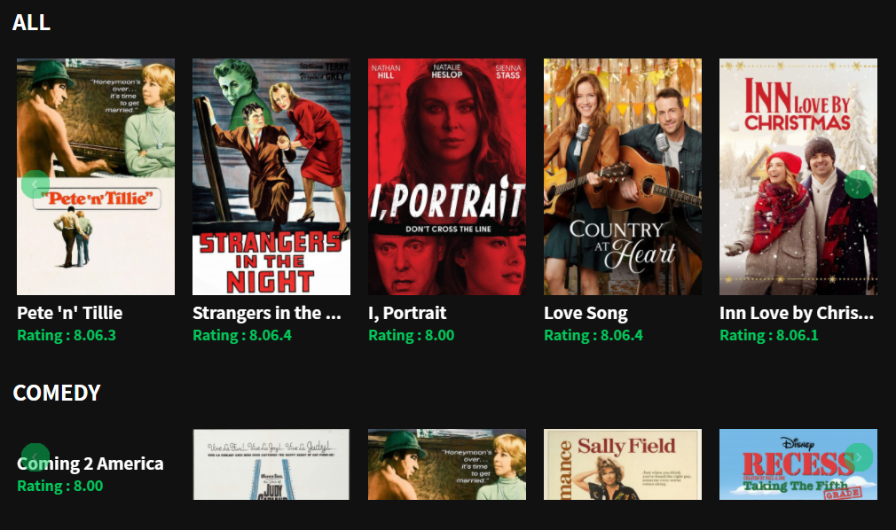
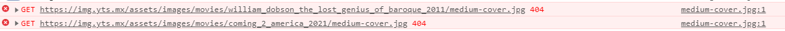
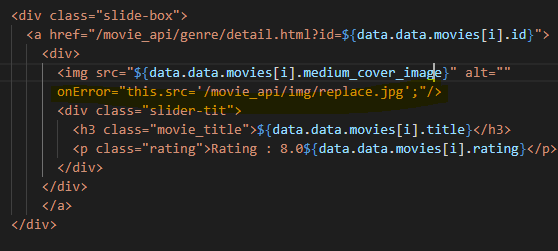
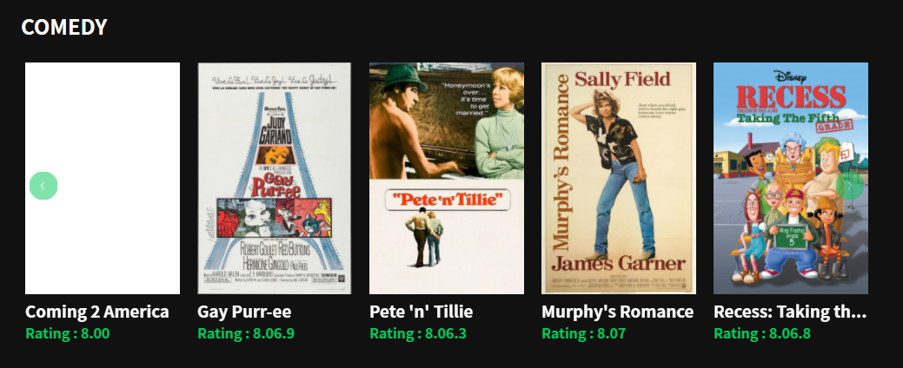

img 태그 404 Error를 대비해 대체 이미지 띄워봅시다

<!--truncate-->

## 상황

API로 이미지를 불러오는 도중, 이미지가 깨져 에러가 띄워지는 문제 발생.




## 해결 방법

- onerror 속성을 이용한다.

1. 대체 이미지 노출

```html title="index.html" {4}

```

2. 이미지 숨기기

```html title="index.html" {4}

```

## 해결





## 이미지를 가져올 수 없는 몇 가지 상황

- src 속성이 비었거나 null임.
- src의 URL이 현재 사용자가 보는 페이지의 URL과 같음.
- 지정한 이미지가 손상돼 불러올 수 없음.
- 이미지의 메타데이터가 손상돼 원본 크기를 알아낼 수 없고, `img` 요소의 속성에도 크기를 지정하지 않음.
- 사용자 에이전트가 지원하지 않는 이미지 형식임.
