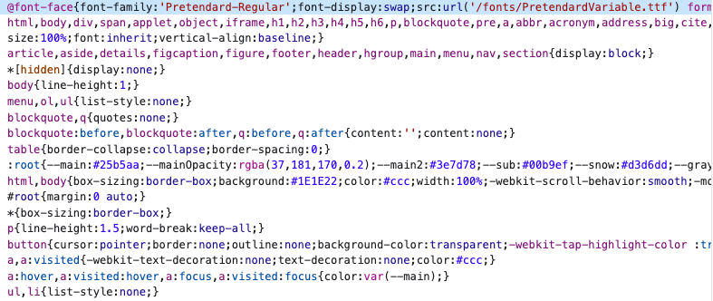
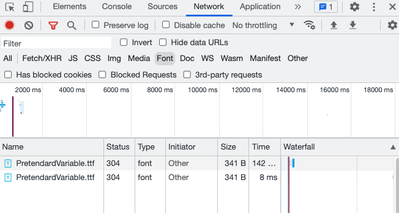

## 1. 사건의 발단

전엔 못 본 거 같은데 다크모드 버튼을 토글할 때, 폰트가 깜빡이는 현상을 목격.

가장 먼저 든 생각은 이게 말로만 듣던 FOUC ('style이 적용되지 않은 내용'이 '깜빡'이는 현상) 인가? 라는 생각에 도달함

그러나 엄밀히 말해, 폰트만 이런 모습을 보이고 있는 것 같아서 FOUT(텍스트가 깜빡여보이는 현상. 즉, 브라우저가 웹 글꼴을 다운로드하기 전에 텍스트가 대체 글꼴로 렌더링되는 현상)으로 추측했음

말로만 듣던 FOUT를 목격하는 건 처음이라 당황스러우면서도 신나게 버그를 해결하기로 결심

## 2. 해결 방법을 찾아보자

### 1) 글꼴 로드하는데 시간이 오래 걸려서일까?

- [글꼴 로드 중 보이지 않는 텍스트 방지](https://web.dev/avoid-invisible-text/)
  - 해당 글은 font-display를 소개하고 있다. 이 css를 사용하면 글꼴이 준비되지 않았을 경우, 각 브라우저가 어떻게 대응하는지 알려주고 있다.
  - 글을 참조하여 코드를 [수정](https://github.com/uhgenie7/portfolio2022/commit/1824116ddd63fdc6baec07ce84e43e75e9d3ddfa)해보았다.
  - [디버깅](https://github.com/uhgenie7/portfolio2022/commit/23a3c7b13ef6f16a395320bbbe323a55de1dde97)도 해보았다.

그러나 해결되지 않았다. 라이브러리로 테스트를 했을 때, 아주 잘 렌더링되고 있었고 여전히 폰트 깜빡임 현상은 남아있었다.

### 2) 애초에 어떻게 사용자 지정 폰트를 지정해주었는데?

처음부터 이런 일이 생긴 건 아니었다. 분명 사용자 지정 폰트를 지정한 뒤에 이런 일이 생겼다는 것을 발견할 수 있었다.  
근본적으로, 폰트 렌더링에 문제가 있을 것이므로, 내가 어떻게 사용자 지정 폰트를 지정해주었는지 확인해본 결과, Styled-Component에서 `globalstyle로 font-family를 준 것`을 확인할 수 있었다.

- [코드](https://github.com/uhgenie7/portfolio2022/commit/b76a076edf5f96a07c21ce9ddfb4cdd93d1862a9)

```ts title="src/styles/globalStyle.ts"
const GlobalStyle = createGlobalStyle`
  ${reset};
  ${variables};
  @font-face {
    font-family: 'Pretendard-Regular';
    src: url('/fonts/PretendardVariable.ttf') format('woff');
    font-weight: 400;
    font-style: normal;
  }

  html,
  body {
	@@ -13,8 +20,9 @@ const GlobalStyle = createGlobalStyle`
    color: ${({ theme }) => theme.textColor};
    width: 100%;
    scroll-behavior: smooth;
    font-family: Pretendard-Regular, -apple-system, sans-serif;
  }
`
```

### 3) styled-component를 잘못 쓰고 있었던 게 아닐까?

아니나 다를까, 나와 같은 문제를 겪고 있는 사람이 존재했다.

- [해당 이슈](https://github.com/styled-components/styled-components/issues/1593)
- Styled-Components는 스타일이 Render 될 때 마다 head 태그의 style 태그를 변경한다. 즉, 새로운 스타일이 등장할 때마다 `폰트를 재요청`하는 현상이 나타난 것!

이슈를 확인해보았으니, 내 사이트에서도 그러한 현상이 일어나고 있는 것인지 확인해보았다.

아래는 다크모드를 토글할 때마다 style에 변화가 일어나는 것을 확인한 태그이다.  

head 아래 style이 담겨있다.


network/font 탭에도 다크모드를 토글할 때마다 폰트가 계속 담기는 것을 확인할 수 있었다.

### 4) 해결 방법은?

- [@font-face를 globalStyle에 넣지 말고 쏙 빼내서 css로 다루면 된다.](https://github.com/uhgenie7/portfolio2022/commit/b1a13fcb7b1ef8b0d7ac226be8d5322af274c003)

```css title="src/styles/font.css"
@font-face {
  font-family: 'Pretendard-Regular';
  font-display: swap;
  src: url('/fonts/PretendardVariable.ttf') format('woff');
  font-weight: 400;
  font-style: normal;
}
```

```tsx title="pages/_app.tsx"
import GlobalStyle from '@src/styles/globalStyle';
import Head from 'next/head';
import Favicon from '@src/components/Favicon';
import '../src/styles/font.css';

function MyApp({ Component, pageProps }: AppProps) {
  const [mounted, setMounted] = useState(false);

  //   ...
}
```

### 5) NextJS

- 해당 이슈가 발생한 프로젝트는 NextJS로 만들어졌다.
- NextJS는 프레임워크이기 때문에, 글로벌 css에 대한 규칙도 정해져 있다.
- 마음대로 css를 import 할 경우 [Global CSS Must Be in Your Custom App 에러를 직면하게 될 것](https://nextjs.org/docs/messages/css-global)이다...

## 3. 전체 코드

```tsx title="pages/_app.tsx"
import '../src/styles/font.css';

function MyApp({ Component, pageProps }: AppProps) {
  return (
    <>
      <GlobalStyle />
      <Component {...pageProps} />
    </>
  );
}

export default MyApp;
```

```css title="src/styles/font.css"
@font-face {
  font-family: 'Pretendard-Regular';
  font-display: swap;
  src: url('/fonts/PretendardVariable.ttf') format('woff');
  font-weight: 400;
  font-style: normal;
}
```

```ts title="src/styles/globalStyle.ts"
import { createGlobalStyle } from 'styled-components';

const GlobalStyle = createGlobalStyle`
  html,
  body {
    font-family: Pretendard-Regular, -apple-system, sans-serif;
  }
 `;
```
