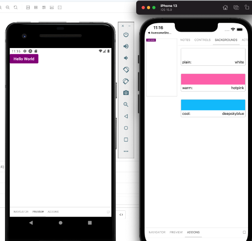

예전에는 react-native에서 storybook을 사용하면 디바이스 위에 띄워졌다.



```
const module = STORYBOOK_START ? require('../storybook').default : App;
```

이러한 느낌으로 스위치 하듯이 써야 했고, 스토리북과 앱을 동시에 보기 힘들기 때문에 불편함이 이만저만이 아니었다.

이러한 불편함을 해소하기 위해 약간의 꼼수로 [웹뷰로 띄워서 보는 게 최선](https://dev.to/ugglr/step-3-setting-up-storybook-with-react-native-web-show-your-mobile-components-the-browser-12ke)이었는데 그 과정이 꽤 복잡했다.

어느 날 이마저도 통하지 않는 문제가 발생하여, [버그를 픽스](../rn_datetimepicker_error.md)했으나 임시방편에 불과해서 스토리북 자체를 업그레이드 시도했다.

참고로 스토리북을 업그레이드 하면, node_modules에서 `@storybook/react/bin/index.js` 파일을 읽지 못해, 기존에 쓰던 웹뷰 꼼수를 쓸 수 없게 된다.

<!--truncate-->

:::note
prev 버전. 딱 봐도 너무 레거시했다...

```
 "dependencies": {
    "@react-native-async-storage/async-storage": "1.17.0",
    "@react-native-community/datetimepicker": "6.1.2",
    "react-native": "0.67.5",
    "react": "17.0.2",
},
  "devDependencies": {
    "@storybook/addon-actions": "5.3.21",
    "@storybook/addon-controls": "6.5.13",
    "@storybook/addon-essentials": "^6.5.12",
    "@storybook/addon-interactions": "6.5.13",
    "@storybook/addon-links": "5.3.21",
    "@storybook/addon-ondevice-actions": "5.3.23",
    "@storybook/addon-ondevice-knobs": "5.3.25",
    "@storybook/addon-react-native-web": "0.0.18",
    "@storybook/builder-webpack4": "^6.5.12",
    "@storybook/jest": "0.0.10",
    "@storybook/manager-webpack4": "^6.5.12",
    "@storybook/react": "^6.5.12",
    "@storybook/react-native": "5.3.25",
    "@storybook/react-native-server": "^5.3.23",
    "@storybook/test-runner": "0.9.0",
    "@storybook/testing-library": "0.0.13",
    "react-dom": "17.0.1",
    "react-native-storybook-loader": "2.0.5",
    "react-native-web": "0.18.9",
    "typescript": "^3.8.3"
}
```

:::

## 1. 업그레이드 준비

react-native용 storybook은 v6.5.X, react(웹뷰로 띄워보기 위함임)용 storybook은 v7.0.X을 쓰고 싶었다.

스토리북에서는 친절하게도 automigrations 기능을 갖추고 있다. 이 기능을 쓰면 명령어 한 줄로 모든 코드가 최신 버전으로 업그레이드 된다.

```
npx storybook@latest upgrade --prerelease
```

:::note
이때 기존에 storybook 이라는 폴더가 아닌, 다른 이름을 쓰고 있었다면`--config-dir 폴더이름` 명령어를 붙여주자
:::

이렇게 하면 스토리북과 관련된 package 버전이 올라간다.

:::note
after.

몇몇 라이브러리(@react-native-community/slider 등)는 직접 사용하지는 않지만, 스토리북이 쓰고 있어서 설치해야 한다. 설치하지 않으면 터미널에서 에러가 남.

react와 react-native 역시 스토리북이 auto 마이그레이션해주지 않지만, 스토리북의 버전이 높아서 같이 올려주는 수밖에 없었다.

```
 "dependencies": {
    "@react-native-async-storage/async-storage": "1.17.0",
    "@react-native-community/datetimepicker": "6.1.2",
    "@react-native-community/slider": "4.4.2",
    "react-native": "0.68.0",
    "react": "18.2.0",
},
  "devDependencies": {
    "@storybook/addon-actions": "7.0.6",
    "@storybook/addon-controls": "7.0.6",
    "@storybook/addon-essentials": "^7.0.6",
    "@storybook/addon-interactions": "7.0.6",
    "@storybook/addon-links": "7.0.6",
    "@storybook/addon-mdx-gfm": "7.0.6",
    "@storybook/addon-ondevice-actions": "^6.5.1",
    "@storybook/addon-ondevice-backgrounds": "^6.5.1",
    "@storybook/addon-ondevice-controls": "^6.5.1",
    "@storybook/addon-ondevice-notes": "^6.5.1",
    "@storybook/addon-react-native-web": "0.0.20-next.3",
    "@storybook/core-common": "7.0.6",
    "@storybook/jest": "0.1.1-next.0",
    "@storybook/react": "^7.0.6",
    "@storybook/react-native": "6.5.3",
    "@storybook/react-native-server": "^6.5.0-rc.12",
    "@storybook/react-webpack5": "7.0.6",
    "@storybook/test-runner": "0.11.0-next.0",
    "@storybook/testing-library": "0.0.14-next.2",
    "react-dom": "18.2.0",
    "react-native-storybook-loader": "2.0.5",
    "react-native-web": "0.18.9",
    "typescript": "^4.8.4",
}
```

:::

react-native용 storybook을 6.5.X로 사용하기 위해서는 몇 가지 라이브러리들을 최신 버전으로 유지할 필요가 있다. 대부분 자동 마이그레이션이 되었겠지만, 아래를 확인해서 빠진 라이브러리는 추가로 설치해주자.

1. 의존성

```
yarn add -D @storybook/react-native @storybook/core-common @react-native-async-storage/async-storage react-native-safe-area-context react-dom
```

2. Controls (the new knobs)

```
yarn add -D @storybook/addon-ondevice-controls @storybook/addons @storybook/addon-controls @react-native-community/datetimepicker @react-native-community/slider
```

3. Actions

```
yarn add -D @storybook/addon-ondevice-actions @storybook/addon-actions
```

또한 package.json에서 storybook을 켜는 명령어도 바뀌었다.

```json
"scripts": {
    "storybook": "storybook dev -p 7008",
    "storybook-generate": "sb-rn-get-stories",
    "storybook-watch": "sb-rn-watcher",
}
```

## 2. 업그레이드 후에

### 1. .storybook

루트에 `.storybook`폴더가 생겨있어야 한다.
기존에는 storybook 폴더 아래에 main.js, preview.js가 있었다면, .storybook으로 옮겨졌다.

뭔가 제대로 마이그레이션이 안 됐다면, [react-native 문서](https://github.com/storybookjs/react-native/blob/v6.5/MIGRATION.md)를 기초로 확인한다.

### 2. storiesOf 없애기

오랫동안 구버전을 사용하고 있었다면, storiesOf 문법을 쓰고 있었을 텐데, 최신 문법으로 바꾸는 명령어도 지원한다.

```
npx storybook@next migrate storiesof-to-csf --glob="src/\*_/_.stories.js"
```

이떄 `src/\*_/_.stories.js`는 각자 stories가 위치한 폴더에 맞게 변형한다. 나의 경우는 `../src/components/**/**/*.stories.tsx`에 위치해있다.

### 3. Addon-knobs 이용 중지

Addon-knobs는 addon-controls로 대체되어가고 있으므로 [마이그레이션](https://github.com/storybookjs/storybook/tree/next/code/addons/controls?ref=storybookblog.ghost.io#how-do-i-migrate-from-addon-knobs) 하는 게 좋다.
`@storybook/addon-knobs`를 사용하고 있는 파일을 Controls로의 마이그레이션한다.

## 3. 빌드 에러

1. sealing plugins docgenplugintypeerror: cannot read properties of undefined (reading 'createexpressionstatement')

타입스크립트 버전이 너무 낮아서 나는 에러.
타입스크립트 버전을 4.8.4 으로 올린다.

2. you may need an appropriate loader to handle this file type, currently no loaders are configured to process this file.

웹팩 로더 문제. 이러한 메시지가 뜬다면 웹팩 문제다.

혹은 리액트 네이티브 코드를 읽지 못하는 문제 등...

```
return <react_native_1.View style={{ width, flex: 1 }}>{this.props.renderItem(props)}</react_native_1.View>;

// 이런 거나

return <BaseToast style={{ borderLeftColor: '#69C779' }} {...props}/>;

// 이런 것
```

문제 있는 라이브러리들을 webpack.config.js 파일에 `module:{rules:[]}`에 채워넣어주자

> react-native인데 웬 웹팩? 할 수 있겠지만, 스토리북을 웹으로 띄워서 보기 위해선 웹팩이 있어야 했다.

```js title="index.web.js"
import React from 'react';
import ReactDOM from 'react-dom';

import App from './App.web';

ReactDOM.render(<App />, document.getElementById('app'));
```

```tsx title="App.web.tsx"
import React from 'react';
import { Text, View } from 'react-native';

function App() {
  return (
    <View>
      <Text>Hello world from react native</Text>
    </View>
  );
}

export default App;
```

```js title="webpack.config.js"
const path = require('path');
const HTMLWebpackPlugin = require('html-webpack-plugin');

const HTMLWebpackPluginConfig = new HTMLWebpackPlugin({
  template: path.resolve(__dirname, './public/index.html'),
  filename: 'index.html',
  inject: 'body',
});

module.exports = {
  entry: path.join(__dirname, 'index.web.js'),
  output: {
    filename: 'bundle.js',
    path: path.join(__dirname, '/build'),
  },
  module: {
    // 여기
    rules: [
      {
        test: /@?(react-native-swiper).*\.(ts|js)x?$/,
        loader: 'babel-loader',
      },
    ],
  },
  plugins: [HTMLWebpackPluginConfig],
};
```

```js title=".storybook/main.js"
const path = require('path');
const webpack = require('webpack');
import TsconfigPathsPlugin from 'tsconfig-paths-webpack-plugin';
import custom from '../webpack.config.js'; // 웹팩을 불러서 스토리북에 넣어주자

module.exports = {
  stories: ['../src/components/**/**/*.stories.tsx'],
  addons: [
    '@storybook/addon-links',
    '@storybook/addon-essentials',
    '@storybook/addon-interactions',
    '@storybook/addon-controls',
    '@storybook/addon-actions',
    '@storybook/addon-mdx-gfm',
  ],
  docs: {
    autodocs: true,
  },
  features: {
    interactionsDebugger: true,
  },
  webpackFinal: (config) => {
    config.plugins.push(
      // Removing Speedy so the static storybook styling doesn't break
      new webpack.DefinePlugin({
        SC_DISABLE_SPEEDY: true,
      }),
      new TsconfigPathsPlugin({
        extensions: config.resolve.extensions,
      })
    );
    config.resolve.modules = [
      ...(config.resolve.modules || []),
      path.resolve(__dirname, '../'),
      path.resolve(__dirname, 'src/component'),
    ];
    config.resolve.alias = {
      ...(config.resolve.alias || {}),
      'react-native$': 'react-native-web',
      '@storybook/react-native': '@storybook/react-webpack5',
    };

    config.resolve.extensions = ['.web.js', '.tsx', '.ts', '.js'];

    return {
      ...config,
      module: {
        ...config.module,
        rules: [...config.module.rules, ...custom.module.rules],
      },
    };
  },
  framework: {
    name: '@storybook/react-webpack5',
    options: { fastRefresh: true },
  },
};
```

3. node_modules/react-native 에러

```
✘ [ERROR] Unexpected "typeof"

    node_modules/react-native/index.js:14:7:
      14 │ import typeof AccessibilityInfo from './Libraries/Components/AccessibilityInfo/AccessibilityInfo';
         ╵        ~~~~~~

ERR! Error: Build failed with 1 error:
ERR! node_modules/react-native/index.js:14:7: ERROR: Unexpected "typeof"
```

이렇게 node_modules/react-native 에서 에러가 난다면, `.storybook/main.js` 파일 안의 addon의 문제이다.

```
    '@storybook/addon-ondevice-notes',
    '@storybook/addon-ondevice-controls',
    '@storybook/addon-ondevice-backgrounds',
    '@storybook/addon-ondevice-actions',
```

같은 게 들어가있다면 이러한 에러가 뜨는데, 웹으로 스토리북을 볼 것이기 때문에 디바이스가 아니므로 이런 에러가 나는 것으로 추정된다. 웹용 addon을 사용하자.

```
    '@storybook/addon-links',
    '@storybook/addon-essentials',
    '@storybook/addon-interactions',
    '@storybook/addon-controls',
    '@storybook/addon-actions',
    '@storybook/addon-mdx-gfm',
```

4. cannot create property \_updatefibers on number '0'

   리액트 버전이 너무 낮아서 생기는 에러로 추정된다. react의 버전을 v18로 올리면 사라진다. (react-dom 포함)

## 참조

- [Storybook for React Native (6.5)](https://storybook.js.org/blog/storybook-for-react-native-6-5/)
- [Storybook/react-native 마이그레이션 문서](https://github.com/storybookjs/react-native/blob/next/MIGRATION.md)
- [Storybook 마이그레이션 문서](https://github.com/storybookjs/storybook/blob/next/MIGRATION.md)
- [스토리북에서 웹팩 쓰는 법](https://storybook.js.org/docs/react/builders/webpack#typescript-module-resolution)
